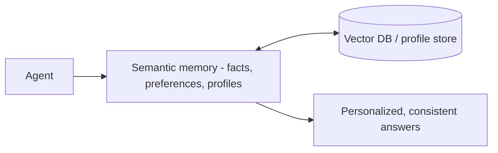

*Kiến thức bền lâu.*

## Là gì

Một kho bền vững chứa sự kiện, sở thích, hồ sơ về người dùng hoặc chủ đề — những thứ cần tồn
tại qua các phiên và được áp dụng nhất quán.

## Khi nào cần

Người dùng phải lặp lại chính mình qua các phiên, hoặc câu trả lời cần cá nhân hóa và nhất
quán — mà không bắt user nêu lại cùng một context mỗi lần.

## Lưu ở đâu

Một [vector DB]() hoặc một profile store có cấu
trúc, ghi khi một dữ kiện bền vững xuất hiện và truy xuất khi liên quan tới lượt hiện tại.

## Ví dụ

Agent lưu *"user thích đơn vị mét"* một lần và áp dụng ở mọi phiên sau — user không bao giờ
phải nói lại.

## Liên quan

- [Vector databases]() — nơi lưu và tìm các dữ kiện bền vững.
- Khác [external memory](): semantic là *học về user*, external là *tài liệu của bạn*.
