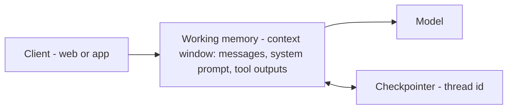

*Cửa sổ context đang hoạt động.*

## Là gì

Mọi thứ model "thấy" ở lượt này: các tin nhắn hiện tại, system prompt, output của tool, và các
bước suy luận. Đây là scratchpad của agent — và là bộ nhớ duy nhất model thực sự có, vì model
stateless giữa các lần gọi.

## Khi nào cần

Luôn luôn — đây là mức nền mọi agent chạy trên đó, do
[harness]() quản lý. Một *checkpointer* gắn với thread
id cho phép cuộc hội thoại dừng và resume.

## Lưu ở đâu

Ngay trong [context window]() — không lưu ở đâu khác.
Phần engineering là quản lý context: khi đầy, bạn **trim hoặc tóm tắt** các lượt cũ, nếu không
run sẽ vỡ.

## Ví dụ

Hỏi *"vừa nãy tôi nói gì?"* và agent trả lời bằng cách nhìn lại trong cửa sổ — không kho, không
truy xuất, chỉ là những gì đang có trong context.

## Liên quan

- [Context engineering]() — cách giữ cửa sổ gọn.
- [The agent harness]() — thứ quản lý vòng lặp và checkpointer.
