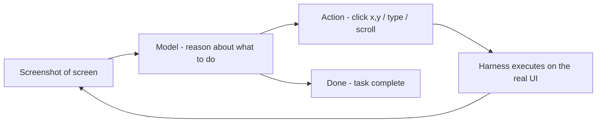

## Mục tiêu

Phần lớn vault này nói về agent đọc và viết *văn bản*. Trang này nói về agent **hành động trong
thế giới**: điều khiển màn hình máy tính, trò chuyện bằng giọng nói, hoặc điều khiển thiết bị.
Model vẫn thế; cái thay đổi là *giao diện* giữa nó và thực tại.

## Computer use — vòng lặp

**Computer use** cho phép agent thao tác một GUI như con người: nó được đưa một **ảnh màn
hình**, quyết một hành động (*click chỗ này, gõ cái này, cuộn*), harness **thực thi** trên màn
hình thật, và agent thấy ảnh màn hình *tiếp theo*. Đó là
[vòng lặp agent](), nhưng tool là chuột và bàn
phím.

Ví dụ: *"đặt vé rẻ nhất đi Hà Nội thứ Sáu tuần sau."* Agent chụp màn hình trình duyệt, click ô
tìm kiếm, gõ chặng bay, đọc kết quả, chọn cái rẻ nhất, và điền form — mỗi bước chọn từ đúng cái
nó vừa thấy. Nó chạy với **bất kỳ** phần mềm nào, kể cả app không có API, vì nó dùng đúng giao
diện mà con người dùng.

## Biến thể real-time và embodied

- **Voice / real-time** — cùng suy luận, nhưng ràng buộc là độ trễ. Speech-to-text vào, model
  suy luận, text-to-speech ra — đủ nhanh để cảm giác như hội thoại. Dùng cho phone agent và trợ
  lý trực tiếp.
- **Robotics / embodiment** — "màn hình" thành cảm biến và "click" thành lệnh động cơ. Khó hơn
  nhiều (thế giới vật lý không khoan nhượng), nhưng vòng lặp vẫn thế: cảm nhận → suy luận → hành
  động → cảm nhận.

## Khác multimodality thế nào

[Multimodality]() là về *đầu vào* — model
*thấy* ảnh hoặc *nghe* âm thanh. Computer use là về *hành động* — model *làm* điều gì đó trong
một môi trường sống và phản ứng với hệ quả. Multimodality là điều kiện cần (agent phải thấy màn
hình để thao tác), nhưng hành động trong một vòng lặp mới là phần mới.

## Điểm mạnh & hạn chế

- **Điểm mạnh** — chạy với phần mềm không có API (app cũ, mọi website); tự động hóa trọn quy
  trình của con người; cùng một kỹ năng khái quát qua nhiều tool.
- **Hạn chế** — **chậm và giòn** (một nút bị dời là hỏng; mỗi bước là một lần gọi model đầy đủ
  trên một ảnh); và lớn nhất — **nó có thể thực hiện hành động thật, khó hoàn tác**, nên là một
  bề mặt [security]() và
  [giám sát]() nghiêm trọng.
  Sandbox nó, đặt cổng duyệt cho các hành động không đảo ngược, và đừng bao giờ chĩa nó vào một
  hệ thống mà một cú click sai là thảm họa.

## Nguồn

- [Anthropic — Introducing computer use](https://www.anthropic.com/news/3-5-models-and-computer-use)
- [Anthropic — Computer use (docs)](https://docs.claude.com/en/docs/build-with-claude/computer-use)
