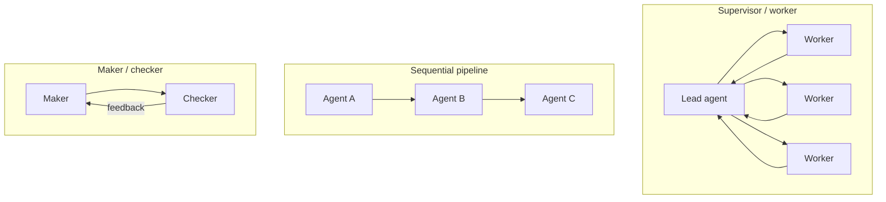
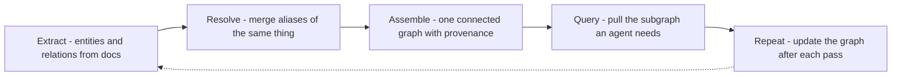

## Mục tiêu

Hiểu khi nào nhiều agent thắng một, chúng phối hợp ra sao, và vấn đề cốt lõi xuất hiện ngay
khi chúng chạy dài: **agent không có trí nhớ lâu dài**. Lời giải mà trang này hướng tới là một
*knowledge graph chung* — bộ nhớ mà cả nhóm cùng đọc và ghi.

## Single vs multi-agent

Xuất phát từ mặc định của vault: *ít* bộ phận chuyển động nhất mà vẫn giải được việc. Một
[agent]() đơn với tool tốt xử lý được đa số
việc, rẻ hơn và dễ debug hơn. Chỉ dùng nhiều agent khi:

- Tác vụ **tách thành các sub-task độc lập** chạy song song được (nghiên cứu năm chủ đề cùng lúc).
- Cần **các vai riêng biệt** không nên chung một context (một maker và một checker độc lập,
  hoặc một planner và các worker chuyên biệt).
- Context window của một agent không chứa nổi cả việc.

Multi-agent không miễn phí: mỗi agent là thêm lời gọi model, thêm phối hợp, và thêm cách hỏng.
Đa số bài toán "cần multi-agent" thật ra là một agent cần tool tốt hơn.

## Topologies

- **Supervisor / worker** — một lead agent chia mục tiêu, giao cho các worker, rồi tổng hợp
  kết quả. Hệ nghiên cứu của Anthropic dùng cách này: một lead researcher lập kế hoạch và sinh
  ra subagent cho từng phần. Tốt nhất khi sub-task song song hóa được.
- **Sequential pipeline** — mỗi agent biến đổi và chuyển cho agent kế (extract → analyze →
  write). Tốt nhất khi các bước có thứ tự và tách bạch.
- **Maker / checker** — một agent tạo, một agent khác kiểm chứng độc lập. Đúng mẫu validator
  của [loop-engineering](), tách ra hai agent để
  checker không tự chấm bài của chính mình.

## Vấn đề cốt lõi — một nhóm không có trí nhớ

Một [agent không có trí nhớ lâu dài](): mọi thứ nó
biết nằm trong [context window]().
Khi cuộc hội thoại kết thúc hoặc vượt cửa sổ, "ký ức" đó biến mất. Với *một* agent, bạn quản
việc này bằng các loại memory (semantic, episodic, …). Nhưng với *nhiều* agent chạy hàng giờ
hay hàng ngày, mỗi con là một **nhân viên mới mỗi phiên** — và chúng không chia sẻ được thứ đã
học. Chuyền nguyên transcript giữa các agent thì không scale và mất nguồn gốc.

## Knowledge graph làm bộ nhớ chung

Cách khắc phục: thay vì mỗi agent tự nhớ riêng, **tất cả agent cùng đọc và ghi một knowledge
graph chung** — node là thực thể, edge là quan hệ, và mỗi dữ kiện mang theo nguồn của nó. Tri
thức trở nên bền vững, truy nguồn được, và tái dùng được qua các agent và phiên. Quy trình của
Anthropic để xây và dùng nó gồm năm bước:

- **Extract** — rút thực thể và triple subject–predicate–object từ mỗi tài liệu (một model rẻ,
  một call mỗi doc, theo một schema định sẵn).
- **Resolve** — hợp nhất các cách gọi khác nhau của cùng một đối tượng (*"Edwin Aldrin"* →
  *"Buzz Aldrin"*) bằng ngữ nghĩa, không phải trùng chuỗi — một model mạnh hơn suy luận qua mô tả.
- **Assemble** — dựng node chuẩn và edge có kiểu thành một graph liền mạch, với **provenance**
  trên mỗi triple (nó đến từ tài liệu nào).
- **Query** — kéo đúng subgraph một agent cần để suy luận, để mỗi câu trả lời trích được một
  edge cụ thể.
- **Repeat** — ghi các dữ kiện mới trở lại sau mỗi lượt, để graph lớn dần thay vì reset.

Với bộ nhớ chung này, worker ghi phát hiện vào graph, checker fact-check với nó, và một việc
chạy dài có thể **resume qua đêm** thay vì bắt đầu lại. Nhóm thôi là một tập những người lạ và
bắt đầu làm việc trên tri thức chung của công ty.

## Hai loại "graph" khác nhau — đừng nhầm

Chữ *graph* ở đây bị dùng chồng nghĩa:

- **Knowledge graph** (trang này) — một cấu trúc *dữ liệu*: node = thực thể, edge = quan hệ.
  Nó là **bộ nhớ** chung.
- **Execution graph** ([graph engineering]())
  — một cấu trúc *điều khiển*: node = agent/bước, edge = cái gì chạy tiếp. Nó là phần **đấu dây**.

Một hệ multi-agent thường dùng cả hai: execution graph định tuyến công việc, knowledge graph
ghi nhớ nó.

## Điểm mạnh & hạn chế

- **Điểm mạnh** — song song và vai chuyên biệt gánh được việc một agent không kham nổi; một
  knowledge graph chung cho bộ nhớ bền, **trích dẫn được** qua các agent và phiên, và làm cho
  fact-check cùng resume khả thi.
- **Hạn chế** — phối hợp nhân chi phí, độ trễ và điểm hỏng; một knowledge graph là một pipeline
  thật phải xây và bảo trì (extraction và entity resolution không hoàn hảo, có thể đầu độc
  graph) — nặng hơn một [vector DB](), nên dùng khi
  quan hệ và nguồn gốc quan trọng, không phải cho tra cứu thuần. Bắt đầu với một agent; thêm
  agent, rồi thêm bộ nhớ graph chung, chỉ khi một triệu chứng thật đòi hỏi.

## Nguồn

- [Anthropic — How we built our multi-agent research system](https://www.anthropic.com/engineering/built-multi-agent-research-system)
- Edge et al., *From Local to Global: A Graph RAG Approach to Query-Focused Summarization* (2024) — [arXiv:2404.16130](https://arxiv.org/abs/2404.16130)
- Wang et al., *MIRIX: Multi-Agent Memory System for LLM-Based Agents* (2025) — [arXiv:2507.07957](https://arxiv.org/abs/2507.07957)
- Hong et al., *MetaGPT: Meta Programming for Multi-Agent Collaborative Framework* (2023) — [arXiv:2308.00352](https://arxiv.org/abs/2308.00352)
