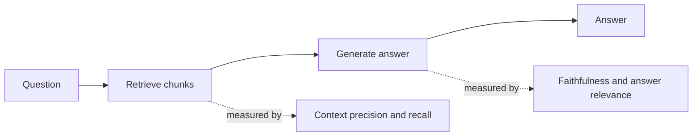

*Vì sao "câu trả lời sai" không bao giờ là một báo lỗi hữu ích cho hệ thống RAG.*

## Mục tiêu

Tìm ra *nửa nào* của pipeline [RAG]() đang hỏng. Một điểm số end-to-end
duy nhất chỉ nói hệ thống tệ; nó không bao giờ nói bạn nên sửa chunking, retriever, hay prompt.
Trang này là phần bổ trợ đặc thù cho RAG của
[Evaluation in practice]().

## Tách pipeline ra trước

RAG có hai nửa có thể hỏng độc lập, và chúng hỏng theo những cách nhìn từ ngoài giống hệt nhau:

| Kiểu hỏng | Trông như thế nào | Sửa ở đâu |
| ------ | ------ | ------ |
| Chunk đúng chưa từng được truy xuất | Tự tin, trôi chảy, sai | Chunking, embedding, hybrid search, re-ranking |
| Chunk đúng đã truy xuất được nhưng bị phớt lờ | Câu trả lời mâu thuẫn với chính nguồn đã đưa cho nó | Prompt, thứ tự context, chọn model |
| Chunk đúng đã truy xuất được nhưng bị chôn vùi | Câu trả lời mơ hồ hoặc thiếu | Top-K, re-ranking, độ dài context |

**Hãy đo retrieval trước khi đụng vào generation.** Chất lượng truy xuất chặn trần chất lượng
câu trả lời — không prompt nào cứu được một context vốn chưa từng chứa câu trả lời, và phần lớn
team dành hàng tuần cho prompt để rồi phát hiện đó là lỗi chunking.

## Bốn chỉ số

Đây là các chỉ số của RAGAS, và mỗi chỉ số cố tình nhìn vào một bộ ba khác nhau của
*câu hỏi*, *context*, và *câu trả lời*:

| Chỉ số | Câu hỏi nó đặt ra | Đầu vào | Sửa gì khi nó thấp |
| ------ | ------ | ------ | ------ |
| **Context recall** | Ta đã truy xuất đủ mọi thứ cần để trả lời chưa? | câu hỏi, context, ground truth | Kích thước chunk, model embedding, top-K, hybrid search |
| **Context precision** | Các chunk truy xuất được có thật sự liên quan, và xếp hạng tốt không? | câu hỏi, context | Re-ranking, lọc metadata, giảm top-K |
| **Faithfulness** | Mọi khẳng định trong câu trả lời có được context chống lưng không? | context, câu trả lời | Prompt, model, thứ tự context |
| **Answer relevance** | Câu trả lời có thật sự trả lời đúng câu hỏi không? | câu hỏi, câu trả lời | Prompt, hiểu truy vấn |

Hai cặp, và hai cặp hành xử khác nhau. **Recall và precision đánh đổi lẫn nhau**: tăng top-K thì
recall lên và precision xuống, và điểm ngọt phụ thuộc workload. **Faithfulness và answer
relevance gần như độc lập**: một câu trả lời có thể bám nguồn hoàn hảo mà vô dụng ("tài liệu
không nói rõ"), hoặc trôi chảy, đúng chủ đề, và hoàn toàn bịa đặt.

Faithfulness là chỉ số đáng để mắt nhất. Nó là phép đo trực tiếp mức
[ảo giác]() trong một hệ thống có nền tảng dữ liệu, và nó cũng là
chỉ số mà mắt thường bỏ sót nhiều nhất — vì một khẳng định không bám nguồn đọc lên y hệt một
khẳng định có bám nguồn.

## Dựng golden set

Các chỉ số vô giá trị nếu không có dữ liệu phản ánh đúng kho tài liệu của bạn.

- **Bắt đầu từ truy vấn thật.** Lấy chúng từ log. Câu hỏi tự nghĩ ra thì sạch hơn, dễ hơn, và
  khác một cách có hệ thống so với thứ người dùng thật sự hỏi.
- **Ghi chú cả nguồn, không chỉ câu trả lời.** Với mỗi câu hỏi, ghi lại *chunk hoặc tài liệu nào
  lẽ ra phải được truy xuất*. Đây chính là thứ khiến context recall tính được, và cũng là phần
  chú thích mà các team hay bỏ qua rồi sau này tiếc.
- **Phủ đủ các dạng, không chỉ các chủ đề.** Hãy có câu hỏi multi-hop, câu hỏi mà câu trả lời
  không nằm trong kho (câu trả lời đúng là "tôi không biết" — và hệ thống bịa ra một câu ở đây là
  kiểu hỏng nguy hiểm nhất), tài liệu gần trùng nhau, và câu hỏi chỉ trả lời được từ bảng hoặc ảnh.
- **Sinh tự động là điểm khởi đầu.** Để model sinh cặp câu hỏi–câu trả lời từ tài liệu của bạn
  giúp phủ nhanh, nhưng nó thừa hưởng thiên lệch về phía những câu hỏi dễ trả lời từ một chunk
  duy nhất. Hãy duyệt tay một mẫu.
- **100–200 ví dụ chọn kỹ thắng 10.000 ví dụ sinh tự động.** Bộ dữ liệu phải đủ nhỏ để thật sự có
  người đọc hết các ca thất bại.

## RAGAS vs một LLM judge tự viết

RAGAS là một thư viện các chỉ số tham chiếu nói trên, phần lớn hiện thực bằng prompt
LLM-as-judge với một cách phân rã được định nghĩa rõ — ví dụ faithfulness tách câu trả lời thành
các khẳng định nguyên tử rồi kiểm từng cái với context, thay vì hỏi "cái này có bám nguồn không?"
trong một lượt.

| | Dùng RAGAS | Dùng judge của riêng bạn |
| ------ | ------ | ------ |
| **Vì sao** | Chuẩn, so sánh được, không phải thiết kế prompt | Rubric của bạn, lĩnh vực của bạn, định nghĩa "đúng" của bạn |
| **Hợp nhất với** | Có một mốc nền trong một buổi chiều; theo dõi bốn trục chuẩn | Tiêu chí lĩnh vực mà RAGAS không có chỉ số — định dạng trích dẫn, giọng điệu pháp lý, tuyên bố miễn trừ bắt buộc |

Chúng không loại trừ nhau, và câu trả lời thường gặp là cả hai: RAGAS cho bốn trục chuẩn, một
judge tự viết cho thứ sản phẩm của bạn đòi hỏi riêng.

Dù chọn đường nào, **hãy validate judge trước khi tin nó**. Gán nhãn tay 30–50 ví dụ, kiểm xem
judge có đồng ý không, và chỉ khi đó mới bắt đầu ra quyết định từ điểm số của nó. Một judge chưa
được validate tạo ra một con số biết nhúc nhích — tệ hơn là không có số nào, vì nó trông giống
bằng chứng.

## Đưa vào CI

Các chỉ số chỉ sinh lời khi trở thành một cổng chặn. Hãy chạy golden set trên mọi thay đổi về
chunking, model embedding, top-K, retriever, prompt, hay phiên bản model — và ghim phiên bản
model, vì một bản cập nhật của nhà cung cấp tự nó đã là một thay đổi cần đánh giá. Hãy fail
build khi faithfulness hoặc context recall tụt quá ngưỡng, và chia báo cáo theo nhóm câu hỏi để
một điểm tổng hợp không thể che giấu một lát cắt đang sụp đổ.

## Điểm mạnh & giới hạn

- **Điểm mạnh** — khoanh vùng lỗi về retrieval hay generation chỉ trong một lần chạy;
  faithfulness cho một con số ảo giác cụ thể, theo dõi được; phần lớn không cần ground truth do
  người viết, nên chạy rẻ trong CI ở mọi thay đổi.
- **Giới hạn** — các chỉ số dựa trên LLM judge có nhiễu và trôi khi model judge đổi, nên phải
  ghim nó; context recall cần ground truth có chú thích, và đó là phần đắt đỏ; điểm số mang tính
  tương đối chứ không tuyệt đối, nên đuổi theo 1.0 là phí công; và không chỉ số nào ở đây nắm bắt
  được độ trễ, chi phí, hay giọng điệu — những thứ người dùng nhận ra nhanh chẳng kém gì tính đúng sai.

## Đi tiếp

- Bộ máy đánh giá tổng quát → [Evaluation in practice]().
- Sửa context recall thấp → [Advanced RAG]().
- Để hệ thống tự chấm và thử lại → [Self-correcting RAG]().
- Theo dõi các chỉ số này khi chạy thật → [Observability]().

## Nguồn

- Es et al., *RAGAS: Automated Evaluation of Retrieval Augmented Generation* (2023) — [arXiv:2309.15217](https://arxiv.org/abs/2309.15217)
- Saad-Falcon et al., *ARES: An Automated Evaluation Framework for Retrieval-Augmented Generation Systems* (2023) — [arXiv:2311.09476](https://arxiv.org/abs/2311.09476)
- Chen et al., *Benchmarking Large Language Models in Retrieval-Augmented Generation* (2023) — [arXiv:2309.01431](https://arxiv.org/abs/2309.01431)
- [RAGAS documentation — metrics](https://docs.ragas.io/en/stable/concepts/metrics/)
