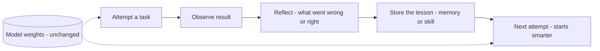

## Mục tiêu

Hiểu cách một agent có thể **giỏi lên qua từng run mà không cần huấn luyện lại** — không đổi
trọng số, không fine-tune. Model đứng yên; cái thay đổi là những gì bao quanh nó. Điều này quan
trọng vì huấn luyện lại thì chậm và đắt, nhưng một agent thiết kế tốt vẫn học được từ chính
trải nghiệm của nó ngay lúc runtime.

## Hai cách "học"

| | Đổi trọng số | Giữ nguyên trọng số (trang này) |
| ------ | ------ | ------ |
| Cơ chế | [Fine-tuning / RL]() — cập nhật model | Memory, reflection, skills quanh một model cố định |
| Tốc độ | Chậm, offline, cần data + compute | Tức thì, lúc runtime |
| Cải thiện cái gì | Năng lực thô của model | Mức độ agent *áp dụng* năng lực cố định đó |
| Trần | Nâng được kỹ năng của model | Bị chặn bởi base model — dùng tốt hơn, không phải năng lực mới |

Self-improvement ở đây là cột thứ hai: năng lực base model là một cái trần, nhưng đa số agent
hoạt động *thấp hơn nhiều* so với trần đó vì chúng quên, lặp lỗi, và suy diễn lại quy trình.
Thu hẹp khoảng cách đó là nơi có lợi ích.

## Ba cơ chế

- **Reflection** — agent tự đánh giá đầu ra so với mục tiêu và thử lại. Trong một task nó sửa
  lỗi; xuyên các task, reflection đã lưu ngăn lặp lại. **Reflexion** cho thấy điều này: một
  agent viết self-reflection sau mỗi lần fail đạt 91% trên một benchmark code so với 80% khi
  không có — cùng model, dùng tốt hơn.
- **Episodic memory** — nhớ kết quả đã qua để lỗi tuần trước không lặp lại. Xem
  [episodic memory]().
- **Procedural memory / xây skill** — đóng gói một task đã giải thành skill tái dùng.
  **Voyager** xây một thư viện skill chạy được ngày càng lớn và ghép chúng cho task mới, nên nó
  thực sự có năng lực hơn qua một phiên — mà không đụng trọng số. Xem
  [procedural memory]().

## Ví dụ — một agent học cách deploy

Một deploy agent fail vì quên chạy migration. Nó **reflect** ("migration phải chạy trước khi
restart"), **lưu** đó thành một bài học episodic, và sau đó **đóng gói** cả trình tự deploy
thành một skill procedural. Tuần sau, với một service mới, nó nhớ lại bài học và tái dùng skill
— thành công ngay lần đầu. Model không hề đổi; *hệ thống quanh nó* đã học.

## Nó nằm ở đâu

Self-improvement là phần thưởng của các loại memory phối hợp với nhau, áp trong một
[loop](). Trong một hệ
[multi-agent](), một knowledge graph chung làm việc học
trở nên *tập thể* — bài học của một agent giúp cả nhóm.

## Điểm mạnh & hạn chế

- **Điểm mạnh** — cải thiện mà không tốn chi phí và độ trễ huấn luyện lại; agent thích nghi với
  môi trường và lỗi *của bạn*; lợi ích tích lũy khi memory và skill dồn lại.
- **Hạn chế** — bị chặn bởi base model — không học được kỹ năng model về cơ bản không có (cái
  đó cần [fine-tuning]()); bài học đã lưu cũ đi hoặc sai
  và có thể đóng đinh một thói quen *xấu* dễ như một thói quen tốt; càng nhiều memory/skill càng
  nhiều nhiễu truy xuất. Hãy kiểm chứng cái được lưu và tỉa bớt — một vòng self-improvement
  không có cổng chất lượng sẽ tự thoái hóa.

## Nguồn

- Shinn et al., *Reflexion: Language Agents with Verbal Reinforcement Learning* (2023) — [arXiv:2303.11366](https://arxiv.org/abs/2303.11366)
- Wang et al., *Voyager: An Open-Ended Embodied Agent with Large Language Models* (2023) — [arXiv:2305.16291](https://arxiv.org/abs/2305.16291)
- Huang et al., *Large Language Models Can Self-Improve* (2022) — [arXiv:2210.11610](https://arxiv.org/abs/2210.11610)
