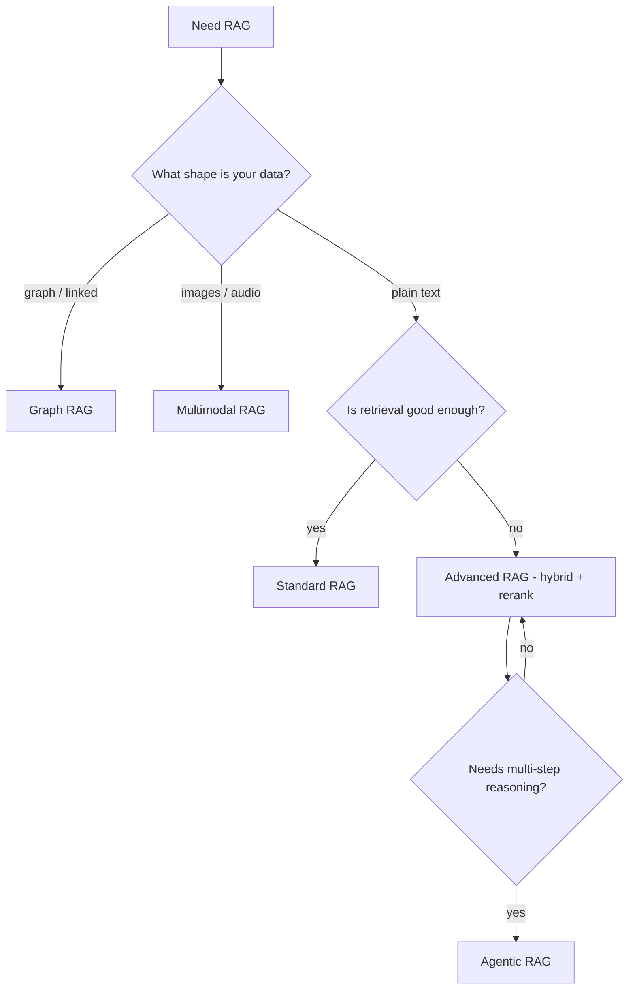

"RAG" đã phát triển thành một họ biến thể. Điều gây nhầm là: có cái là **kiến trúc** riêng, có
cái chỉ là **kỹ thuật** dùng bên trong một kiến trúc. Trang này tách bạch chúng.

## Cả họ RAG

| Loại | Khác ở đâu | Khi nào dùng |
| ------ | ----------- | -------------- |
| **Standard (naive) RAG** | Pipeline cố định: retrieve top-k → augment → generate | Q&A đơn giản trên tài liệu |
| **Advanced RAG** | Truy xuất tốt hơn: hybrid search, re-ranking, query transform | Khi naive truy xuất trượt |
| **Agentic RAG** | Một agent tự quyết *khi nào* và *truy gì*, có thể lặp | Câu hỏi phức tạp, nhiều bước |
| **Graph RAG** | Truy xuất trên knowledge graph (thực thể + quan hệ) | Câu hỏi liên kết, multi-hop |
| **Multimodal RAG** | Truy xuất ảnh, bảng, audio — không chỉ text | Nguồn đa phương thức |

## Kiến trúc vs kỹ thuật

Đây là phân biệt gỡ được sự nhầm lẫn:

- **Kiến trúc** (các dòng trên) thay đổi *hình hài* của hệ thống.
- **Kỹ thuật** cải thiện một bước bên trong một kiến trúc — **không** phải loại RAG riêng:
  - **Hybrid search** (dense + keyword), **re-ranking**, và **query transform** nằm trong
    [Advanced RAG]().
  - **CRAG** (corrective RAG) và **Self-RAG** thêm bước tự kiểm tra ("context truy xuất đã đủ tốt
    chưa?") — là tinh chỉnh, không phải kiến trúc mới.

Nên "bọn mình dùng hybrid search" và "bọn mình dùng agentic RAG" không cùng loại phát biểu: cái
đầu là kỹ thuật, cái sau là kiến trúc.

## Chọn loại nào?

## Đi tiếp

- Cải thiện truy xuất → [Advanced RAG]().
- Dựng pipeline chuẩn → [Building a RAG system]().
- Truy xuất do agent dẫn dắt → Agentic RAG (Giai đoạn 2, sắp có).

Bắt đầu đơn giản. Lên advanced khi truy xuất là nút thắt, và lên agentic chỉ khi câu hỏi thực sự
cần suy luận nhiều bước.
