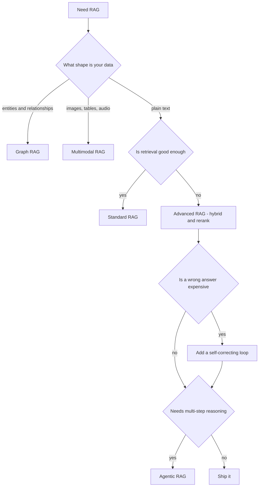

## Mục tiêu

Xác định người ta đang nói tới "RAG" nào, và chọn đúng loại cho dữ liệu, mức chính xác, và ngân
sách của bạn. "RAG" đã phát triển thành một họ, và các thành viên không cùng một *loại* thứ.
Phần này tách bạch chúng.

## Cả họ RAG

| Biến thể | Khác ở đâu | Đọc thêm |
| ------ | ------ | ------ |
| **Standard (naive) RAG** | Pipeline cố định: retrieve top-k, augment, generate | [RAG]() |
| **Advanced RAG** | Cùng hình hài, truy xuất tốt hơn: hybrid search, re-ranking, query transform | [Advanced RAG]() |
| **Self-correcting RAG** | Chấm điểm phần truy xuất hoặc câu trả lời, rồi thử lại | [Trong phần này]() |
| **Graph RAG** | Truy xuất thực thể và quan hệ, không phải chunk rời rạc | [Trong phần này]() |
| **Multimodal RAG** | Truy xuất ảnh, bảng, audio | [Trong phần này]() |
| **Agentic RAG** | Một agent tự quyết *khi nào* và *truy gì*, có thể lặp | [Agentic RAG]() |

## Kiến trúc, vòng lặp, hay kỹ thuật

Đây là phân biệt gỡ được sự nhầm lẫn. Cả họ ở trên chứa ba loại thứ khác nhau:

| Loại | Thay đổi cái gì | Thành viên |
| ------ | ------ | ------ |
| **Kiến trúc** | *hình hài*: bạn truy xuất từ đâu | Standard, Graph, Multimodal, Agentic |
| **Vòng lặp điều khiển** | *dòng chảy*: truy xuất một lần, hay chấm rồi thử lại | CRAG, Self-RAG |
| **Kỹ thuật** | một *bước* bên trong bất kỳ loại nào ở trên | hybrid search, re-ranking, query transform |

Nên "bọn mình dùng hybrid search" và "bọn mình dùng agentic RAG" không cùng loại phát biểu. Cái
đầu gọi tên một bước, cái sau gọi tên một hình hài.

Các danh sách kiểu "sáu kiến trúc RAG" thường trộn cả ba loại vào nhau, nên không danh sách nào
khớp danh sách nào. Hybrid search là ví dụ rõ nhất: nó là một bước truy xuất, và nó thuộc về
bên trong [Advanced RAG](), không phải đứng cạnh.

## Trong phần này

Ba biến thể chưa trang nào trong vault sở hữu thì có trang riêng:

| Trang | Một dòng | Chọn khi… |
| ------ | ------ | ------ |
| [Graph RAG]() | Index thực thể và quan hệ, truy xuất một subgraph liên thông | Câu trả lời cần hai ba dữ kiện nối nhau |
| [Multimodal RAG]() | Truy xuất ảnh, bảng, audio, không chỉ văn xuôi | Ý nghĩa nằm trong media |
| [Self-correcting RAG]() | CRAG và Self-RAG chấm điểm rồi thử lại | Trả lời sai đắt hơn trả lời chậm |

## Chọn loại nào

Các mức là so với standard RAG trên cùng corpus. Chúng cố ý để định tính: con số của bạn phụ
thuộc vào dữ liệu của bạn.

| Biến thể | Tăng độ chính xác | Độ trễ thêm | Chi phí thêm | Độ phức tạp | Đáng dùng khi |
| ------ | ------ | ------ | ------ | ------ | ------ |
| **Standard** | mốc | mốc | mốc | thấp | Text thuần, câu hỏi tra cứu trực tiếp |
| **Advanced** | trung bình | nhỏ, một lượt re-rank | nhỏ | thấp đến trung bình | Truy xuất là nút thắt, và thường là vậy |
| **Self-correcting** | cao với query đòi chính xác | cao, thêm một lần gọi model và đôi khi một lượt truy xuất nữa | cao | trung bình | Một câu trả lời sai rất đắt |
| **Graph** | cao với câu hỏi multi-hop và diện rộng | trung bình lúc query | cao lúc ingest, một lượt model trên toàn corpus | cao | Giá trị nằm ở các quan hệ |
| **Multimodal** | cao khi câu trả lời nằm trong media | nhỏ lúc query | trung bình lúc ingest, một lần gọi cho mỗi media | trung bình | Nguồn không phải văn xuôi |
| **Agentic** | cao với câu hỏi nhiều bước | cao nhất, vài vòng lặp mỗi câu hỏi | cao nhất | cao | Câu hỏi thực sự cần nhiều bước |

Không có kiến trúc nào là tốt nhất. Hãy đọc dòng khớp với **thất bại của bạn**, không phải dòng
có độ chính xác cao nhất.

## Chọn loại nào?

## Đi tiếp

- Cải thiện truy xuất → [Advanced RAG]().
- Dựng pipeline chuẩn → [Building a RAG system]().
- Truy xuất do agent dẫn dắt → [Agentic RAG]().

Bắt đầu đơn giản. Lên advanced khi truy xuất là nút thắt, thêm vòng lặp khi trả lời sai rất
đắt, và lên agentic chỉ khi câu hỏi thực sự cần suy luận nhiều bước.

## Nguồn

- Lewis et al., *Retrieval-Augmented Generation for Knowledge-Intensive NLP Tasks* (2020) — [arXiv:2005.11401](https://arxiv.org/abs/2005.11401)
- Asai et al., *Self-RAG* (2023) — [arXiv:2310.11511](https://arxiv.org/abs/2310.11511)
- Yan et al., *Corrective RAG (CRAG)* (2024) — [arXiv:2401.15884](https://arxiv.org/abs/2401.15884)
- Edge et al., *From Local to Global: A Graph RAG Approach* (2024) — [arXiv:2404.16130](https://arxiv.org/abs/2404.16130)
