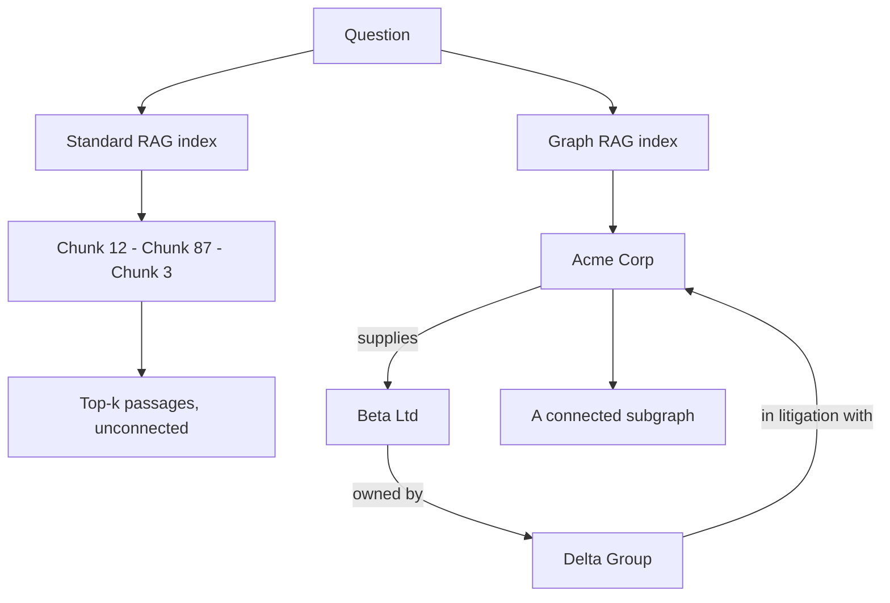

*Truy xuất các liên kết, không chỉ các đoạn văn.*

## Là gì

Standard RAG lưu tài liệu thành các chunk rời rạc. Mỗi chunk được truy xuất dựa trên độ tương
đồng của riêng nó với câu hỏi, và index không hề ghi lại rằng chunk 12 và chunk 87 cùng nói về
một công ty. Graph RAG index **thực thể và quan hệ giữa chúng**, rồi truy xuất một subgraph
liên thông thay vì một danh sách xếp hạng.

## Hoạt động thế nào

Ba việc xảy ra lúc ingest, không phải lúc query:

1. **Extract.** Một model đọc từng chunk và rút ra các thực thể cùng quan hệ giữa chúng.
2. **Resolve.** Gộp trùng lặp, để "Acme", "Acme Corp." và "ACME" thành một node.
3. **Store.** Kết quả được ghi thành một graph gồm node và edge.

Lúc query, hệ thống tìm các node điểm vào cho câu hỏi, rồi đi theo các edge để gom các dữ kiện
liên quan. GraphRAG của Microsoft thêm một bước nữa: gom graph thành các community và viết sẵn
tóm tắt cho từng community, nhờ đó câu hỏi diện rộng được trả lời từ tóm tắt thay vì từ chunk
thô.

Cùng cấu trúc này được dùng ở nơi khác trong vault cho một việc khác. Xem
[Multi-agent systems]() cho knowledge graph với vai
trò *bộ nhớ dùng chung giữa các agent*. Ở đây nó là *index truy xuất*, và các bước dựng là như
nhau.

## Khi nào dùng

- **Câu hỏi multi-hop**, khi câu trả lời cần hai ba dữ kiện nối nhau.
- **Câu hỏi "X và Y liên quan thế nào"**, thứ mà similarity search không diễn đạt được.
- **Câu hỏi diện rộng**, ví dụ "các chủ đề lặp lại trong toàn bộ incident report", khi không
  chunk đơn lẻ nào chứa câu trả lời.

Đừng dùng cho tra cứu trực tiếp. Nếu câu hỏi là "thời hạn hoàn tiền là bao lâu", một chunk đã
chứa sẵn câu trả lời và graph không đem lại gì.

## Ví dụ

Hỏi một trợ lý nhà cung cấp: *"Nhà cung cấp nào của chúng ta thuộc sở hữu của một công ty mà
chúng ta đang kiện tụng?"*

Standard RAG truy xuất danh sách nhà cung cấp và bản ghi nhớ kiện tụng thành hai chunk riêng.
Model không có cách nào nối chúng, nên hoặc đoán, hoặc nói không xác định được. Graph RAG đi
theo `supplies` tới `owned by` tới `in litigation with` và trả về đường đi, nên câu trả lời gọi
đúng tên nhà cung cấp và cho thấy vì sao.

## Cái giá phải trả

Dựng graph nghĩa là chạy một model trên toàn bộ corpus lúc ingest, cộng thêm một lượt entity
resolution. Tài liệu thay đổi thì phải ingest lại. Việc này đắt hơn nhiều so với embedding các
chunk, và đó là lý do chỉ chọn Graph RAG khi giá trị thật sự nằm ở các quan hệ.

## Nguồn

- Edge et al., *From Local to Global: A Graph RAG Approach to Query-Focused Summarization* (2024) — [arXiv:2404.16130](https://arxiv.org/abs/2404.16130)
