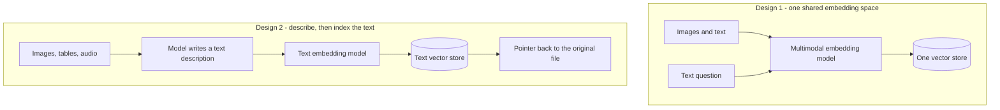

*Khi câu trả lời nằm trong một sơ đồ, không phải một đoạn văn.*

## Là gì

Truy xuất khi nguồn không phải văn xuôi: sơ đồ đấu nối, hóa đơn scan, ảnh biểu đồ, slide, bản
ghi cuộc gọi. Index chỉ có text tìm được trang *nhắc tới* thứ đó, nhưng không tìm được chính
thứ đó.

Trang này nói về **truy xuất**. Về khả năng model đọc ảnh và audio làm đầu vào, xem
[Multimodality]().

## Hai thiết kế

## Hoạt động thế nào

**Design 1** embed ảnh và chữ vào cùng một không gian vector, nên câu hỏi bằng text truy xuất
được ảnh trực tiếp. Đây là ý tưởng của CLIP. Nó gọn, và nó cần một multimodal embedding model
xử lý tốt lĩnh vực của bạn.

**Design 2** chạy một vision model trên từng ảnh hoặc bảng lúc ingest, viết ra một mô tả bằng
text, rồi index mô tả đó. Giữ lại con trỏ tới file gốc để câu trả lời hiển thị được nó.

Design 2 thường là điểm khởi đầu tốt hơn. Stack truy xuất vẫn là stack text bạn đang chạy, mô
tả thì tìm kiếm được và kiểm toán được, và một mô tả sai là thứ con người đọc và sửa được.
Phần parse và OCR lúc ingest thuộc về pipeline trong
[Building a RAG system]().

## Khi nào dùng

Khi ý nghĩa nằm trong media. Nếu ảnh chỉ để trang trí và mọi dữ kiện đều đã có trong văn xuôi,
cứ index văn xuôi và dừng lại ở đó.

## Ví dụ

Một trợ lý hỗ trợ thiết bị. Cách xử lý mã lỗi `E-14` được in trong một sơ đồ đấu nối, còn phần
text của sổ tay chỉ ghi "xem hình 4".

Index chỉ có text truy xuất được câu chứa `E-14`, và trợ lý trả lời "xem hình 4", chẳng giúp
được ai. Với design 2, sơ đồ đã được mô tả lúc ingest, nên context truy xuất được có câu "figure
4 shows relay K3 between the controller and the pump". Câu trả lời giờ gọi đúng tên linh kiện,
và đính kèm ảnh gốc.

## Cái giá phải trả

Mô tả media tốn một lần gọi model cho mỗi item lúc ingest, và mô tả có thể sai theo cách khó
nhận ra. Hãy kiểm tra tay các mô tả cho những tài liệu giá trị nhất, thay vì tin toàn bộ corpus.

## Nguồn

- Radford et al., *Learning Transferable Visual Models From Natural Language Supervision* (2021) — [arXiv:2103.00020](https://arxiv.org/abs/2103.00020)
