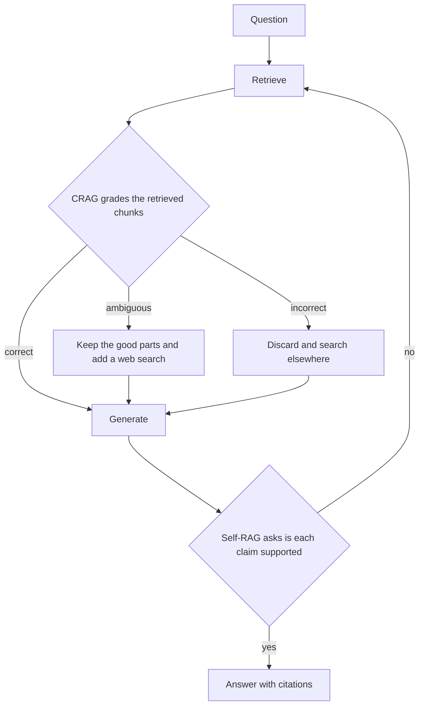

*Kiểm tra phần truy xuất trước khi tin nó.*

## Là gì

Standard RAG truy xuất một lần rồi trả lời, bất kể lấy được gì. Thiết kế self-correcting thêm
một **bước chấm điểm** và một cách thử lại. Có hai thiết kế có tên, và chúng chấm hai thứ khác
nhau:

- **CRAG** chấm các chunk truy xuất được, **trước khi** sinh câu trả lời.
- **Self-RAG** chấm bản nháp câu trả lời của chính nó, **sau khi** sinh, và có thể bỏ qua truy
  xuất hoàn toàn khi câu hỏi không cần.

Sơ đồ trên rút gọn mỗi bài một chỗ. Trong CRAG, bước refine cũng chạy trên nhánh *correct*,
không chỉ trên nhánh ambiguous. Còn cạnh thử lại của Self-RAG là cách các framework agent hay
cài đặt; trong bài gốc, model sinh song song từ nhiều đoạn truy xuất được, rồi các reflection
token chọn ra đoạn được chống lưng tốt nhất.

## Khác nhau ở đâu

| | CRAG | Self-RAG |
| ------ | ------ | ------ |
| Chấm cái gì | các chunk truy xuất được | bản nháp câu trả lời của chính nó |
| Chấm khi nào | trước khi sinh | sau khi sinh |
| Ai quyết định | một model đánh giá truy xuất nhỏ | chính generator, qua các reflection token nó được huấn luyện để phát ra |
| Khi điểm kém thì làm gì | tinh chỉnh chunk, hoặc tìm trên web thay thế | truy xuất lại, hoặc từ chối trả lời |
| Luôn truy xuất | có | không, nó quyết định trước xem có cần truy xuất không |
| Chi phí thêm mỗi query | một lần gọi model đánh giá | một hoặc nhiều lượt sinh thêm |

## Khi nào dùng

Khi một câu trả lời sai đắt hơn một câu trả lời chậm. Tư vấn có quy định quản lý, tóm tắt y tế
hay pháp lý, và bất cứ thứ gì khách hàng sẽ làm theo mà không kiểm tra lại.

Nó không miễn phí, và nó không thay thế việc sửa khâu truy xuất. Nếu bộ chấm cứ trả về
"incorrect", vấn đề nằm ở phía trên. Sửa chunking và hybrid search trước, trong
[Advanced RAG](), rồi mới thêm vòng lặp lên trên một
khâu truy xuất đã chạy tốt.

## Ví dụ

Một trợ lý chính sách nội bộ được hỏi: *"Contractor có được thanh toán vé hạng thương gia
không?"*

Truy xuất trả về chính sách công tác, vốn viết cho nhân viên, và không có gì về contractor.
Standard RAG trả lời dựa trên chính sách nhân viên và sai một cách rất tự tin.

- **CRAG** chấm context đó là ambiguous. Nó giữ phần công tác chung, bỏ các điều khoản chỉ áp
  dụng cho nhân viên, và chạy lần tìm thứ hai giới hạn trong các hợp đồng contractor.
- **Self-RAG** viết nháp trước, phát hiện khẳng định "contractor được đặt hạng thương gia"
  không có đoạn nào chống lưng, và truy xuất lại trước khi trả lời. Nếu lượt thứ hai vẫn không
  thấy gì, nó nói rằng chính sách chưa bao quát trường hợp này.

Cả hai tới cùng một chỗ. CRAG tới bằng cách nghi ngờ đầu vào, Self-RAG bằng cách nghi ngờ chính
mình.

## Cái giá phải trả

Mỗi query được chấm tốn ít nhất một lần gọi model nữa, và vòng lặp có thể chạy hơn một lần. Độ
trễ gần như gấp đôi trong trường hợp xấu. Một cách dung hòa phổ biến là chỉ chạy vòng lặp cho
các query đã bị confidence score đánh dấu, thay vì cho toàn bộ traffic. Xem bước confidence
scoring và escalation trong
[Building a RAG system]().

## Nguồn

- Asai et al., *Self-RAG: Learning to Retrieve, Generate, and Critique through Self-Reflection* (2023) — [arXiv:2310.11511](https://arxiv.org/abs/2310.11511)
- Yan et al., *Corrective Retrieval Augmented Generation* (2024) — [arXiv:2401.15884](https://arxiv.org/abs/2401.15884)
