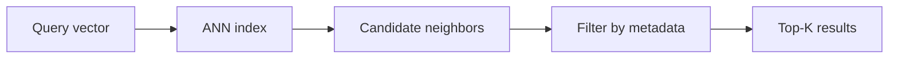

## Mục tiêu

Hiểu chuyện gì xảy ra bên trong cái hộp "vector store" của mọi sơ đồ
[RAG](): làm sao một database tìm được hàng xóm gần nhất
giữa hàng triệu [embedding]() trong vài mili-giây, và
store nào hợp bài toán nào.

## Vấn đề — tìm chính xác không scale được

Tìm các vector gần nhất với truy vấn nghĩa là so nó với *mọi* vector đã lưu — ổn với 10k
vector, vô vọng với 100M ngay lúc truy vấn. Vector database đánh đổi một chút recall lấy rất
nhiều tốc độ bằng chỉ mục **ANN (approximate nearest neighbor)**: trả về các kết quả *gần như
chắc chắn* là gần nhất, nhanh hơn nhiều bậc.

## Ba ý tưởng chỉ mục

| Chỉ mục | Trực giác | Đánh đổi |
| ------ | ------ | ------ |
| **HNSW** — đồ thị phân tầng | Mạng cao tốc: liên kết thô đưa bạn tới đúng vùng thật nhanh, liên kết cục bộ tìm đúng hàng xóm | Recall/tốc độ tốt nhất cho đa số workload; chỉ mục nằm trong RAM |
| **IVF** — inverted file / phân vùng | Gom vector thành cụm; chỉ tìm trong vài cụm gần truy vấn nhất | Ít bộ nhớ, build nhanh; recall tụt nếu trượt đúng cụm |
| **PQ** — product quantization | Nén vector thành mã ngắn; so mã thay vì vector đầy đủ | Tiết kiệm bộ nhớ 10–100×; mất chút độ chính xác — thường kết hợp với IVF |

Bạn hiếm khi tự cài các thứ này — nhưng những núm bạn *sẽ* chỉnh (`efSearch` của HNSW,
`nprobe` của IVF) đều là cùng một chiếc: **duyệt nhiều ứng viên hơn → recall tốt hơn, độ trễ
cao hơn**.

## Lọc theo metadata

Truy vấn thật hiếm khi thuần similarity: *"các đoạn giống truy vấn này — nhưng chỉ từ
handbook 2026, bằng tiếng Anh, cho gói Pro."* Vector store gắn **metadata** vào mỗi vector và
lọc *trong lúc* (không phải sau khi) tìm. Lọc *sau khi* tìm sẽ âm thầm bóp chết kết quả:
top-K có thể toàn rớt filter, để bạn lại tay trắng.

## Chọn store

| Tình huống | Dùng |
| ------ | ------ |
| Đang chạy Postgres sẵn; ≤ vài triệu vector | **pgvector** — bớt một hệ thống, JOIN thẳng bằng SQL với dữ liệu của bạn |
| Thư viện chạy trong process của bạn (batch, nghiên cứu) | **FAISS** — không cần server |
| Prototype nhanh, local-first | **Chroma** |
| Dịch vụ managed, không muốn vận hành | **Pinecone** |
| Tự host ở quy mô lớn, lọc phong phú | **Qdrant / Milvus / Weaviate** |

Mặc định thật thà: **bắt đầu với pgvector**. Chuyển sang store chuyên dụng khi scale, độ trễ
hoặc nhu cầu lọc đòi hỏi — đừng sớm hơn.

## Điểm mạnh & hạn chế

- **Điểm mạnh** — tìm kiếm ngữ nghĩa mili-giây ở quy mô mà tìm chính xác không chạm tới;
  metadata filter làm truy xuất chính xác hơn; recall của ANN chỉnh được theo từng truy vấn.
- **Hạn chế** — *xấp xỉ*: có thể trượt tài liệu liên quan, và bạn phải đo recall (xem
  [Evaluation in practice]()); chỉ mục tốn
  RAM và thời gian rebuild; thêm một hệ thống để chạy, backup, và đồng bộ với tài liệu nguồn —
  thường là phần hay hỏng nhất của một pipeline RAG.

## Nguồn

- Malkov & Yashunin, *Efficient and robust approximate nearest neighbor search using
  Hierarchical Navigable Small World graphs* (2016) — [arXiv:1603.09320](https://arxiv.org/abs/1603.09320)
- Jégou et al., *Product Quantization for Nearest Neighbor Search* (IEEE TPAMI, 2011) — [doi:10.1109/TPAMI.2010.57](https://doi.org/10.1109/TPAMI.2010.57)
- [pgvector — vector similarity mã nguồn mở cho Postgres](https://github.com/pgvector/pgvector)
