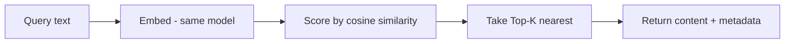
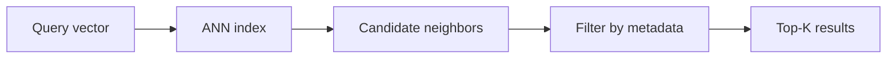

## Mục tiêu

Hiểu chuyện gì xảy ra bên trong cái hộp "vector store" của mọi sơ đồ
[RAG]() — từ một bản ghi chứa gì, tới cách một truy vấn tìm
được các kết quả gần nhất, tới việc giữ nhanh qua hàng triệu
[embedding](), và chọn store nào.

## Một bản ghi gồm gì

Một [embedding]() biến văn bản thành một vector — một
dãy số nắm bắt ý nghĩa. Vector database lưu một **bản ghi (record)** cho mỗi chunk:

| Trường | Ví dụ | Dùng cho |
| ------ | ------ | ------ |
| `id` | `doc42#chunk3` | tham chiếu, cập nhật, dedup |
| `vector` | `[0.021, -0.184, …]` (vd 384–1536 chiều) | similarity search |
| `metadata` | `{source, lang, date, plan}` | lọc + trích dẫn |
| `content` | văn bản gốc | trả về cho model làm context |

Vector là cái bạn *tìm theo*; metadata và content là cái bạn *lọc và trả về*. Giữ nguồn trong
metadata chính là thứ cho phép RAG trích dẫn câu trả lời đến từ đâu.

## Similarity search hoạt động ra sao

"Ý nghĩa giống → vector gần nhau" cần một định nghĩa cho *gần*. Ba metric khoảng cách làm việc
này:

- **Cosine similarity** — góc giữa hai vector; bỏ qua độ dài. Mặc định cho embedding văn bản,
  và là cái đa số model được huấn luyện theo.
- **Dot product** — giống cosine nhưng nhạy với độ lớn; dùng khi vector đã chuẩn hóa (khi đó
  bằng cosine) hoặc khi độ lớn mang tín hiệu.
- **Euclidean (L2)** — khoảng cách đường thẳng; hay dùng cho vector ảnh và không gian.

Hãy dùng **đúng metric mà embedding model của bạn được huấn luyện** — thường là cosine cho văn
bản.

Một truy vấn rồi thực hiện **Top-K retrieval**: embed câu hỏi bằng *cùng một model*, chấm điểm
so với các vector đã lưu, trả về **K cái gần nhất** (K ≈ 3–10 cho RAG). K là một cái núm — quá
nhỏ thì model đói context, quá lớn thì ngập trong các kết quả yếu.

## Vì sao vẫn nhanh — ANN

Chấm truy vấn với *mọi* vector đã lưu (tìm chính xác / brute-force) thì ổn với 10k vector, vô
vọng với 100M ngay lúc truy vấn. Vector database đánh đổi một chút recall lấy rất nhiều tốc độ
bằng chỉ mục **ANN (approximate nearest neighbor)**: trả về các kết quả *gần như chắc chắn* là
gần nhất, nhanh hơn nhiều bậc.

## Ba ý tưởng chỉ mục

| Chỉ mục | Trực giác | Đánh đổi |
| ------ | ------ | ------ |
| **HNSW** — đồ thị phân tầng | Mạng cao tốc: liên kết thô đưa bạn tới đúng vùng thật nhanh, liên kết cục bộ tìm đúng hàng xóm | Recall/tốc độ tốt nhất cho đa số workload; chỉ mục nằm trong RAM |
| **IVF** — inverted file / phân vùng | Gom vector thành cụm; chỉ tìm trong vài cụm gần truy vấn nhất | Ít bộ nhớ, build nhanh; recall tụt nếu trượt đúng cụm |
| **PQ** — product quantization | Nén vector thành mã ngắn; so mã thay vì vector đầy đủ | Tiết kiệm bộ nhớ 10–100×; mất chút độ chính xác — thường kết hợp với IVF |

Bạn hiếm khi tự cài các thứ này — nhưng những núm bạn *sẽ* chỉnh (`efSearch` của HNSW,
`nprobe` của IVF) đều là cùng một chiếc: **duyệt nhiều ứng viên hơn → recall tốt hơn, độ trễ
cao hơn**.

## Lọc theo metadata

Truy vấn thật hiếm khi thuần similarity: *"các đoạn giống truy vấn này — nhưng chỉ từ
handbook 2026, bằng tiếng Anh, cho gói Pro."* Store lọc trên các trường metadata *trong lúc*
(không phải sau khi) tìm. Lọc *sau khi* tìm sẽ âm thầm bóp chết kết quả: top-K có thể toàn rớt
filter, để bạn lại tay trắng.

## Trong pipeline RAG

Vector database là nửa truy xuất của [RAG]():

- **Offline** — chunk tài liệu, embed từng chunk, lưu `id + vector + metadata + content`.
- **Online** — embed câu hỏi, Top-K search (kèm lọc metadata), đưa content trả về cho model
  làm context có căn cứ, trích dẫn từ metadata.

Chất lượng truy xuất chặn trần chất lượng câu trả lời — xem
[Advanced RAG]() cho chunking, hybrid search, và
re-ranking đặt trên nền này.

## Chọn store

| Tình huống | Dùng |
| ------ | ------ |
| Đang chạy Postgres sẵn; ≤ vài triệu vector | **pgvector** — bớt một hệ thống, JOIN thẳng bằng SQL với dữ liệu của bạn |
| Thư viện chạy trong process của bạn (batch, nghiên cứu) | **FAISS** — không cần server |
| Prototype nhanh, local-first | **Chroma** |
| Dịch vụ managed, không muốn vận hành | **Pinecone** |
| Tự host ở quy mô lớn, lọc phong phú | **Qdrant / Milvus / Weaviate** |

Mặc định thật thà: **bắt đầu với pgvector**. Chuyển sang store chuyên dụng khi scale, độ trễ
hoặc nhu cầu lọc đòi hỏi — đừng sớm hơn.

## Điểm mạnh & hạn chế

- **Điểm mạnh** — tìm kiếm ngữ nghĩa mili-giây ở quy mô mà tìm chính xác không chạm tới;
  metadata filter làm truy xuất chính xác hơn; recall của ANN chỉnh được theo từng truy vấn.
- **Hạn chế** — *xấp xỉ*: có thể trượt tài liệu liên quan, và bạn phải đo recall (xem
  [Evaluation in practice]()); chỉ mục tốn
  RAM và thời gian rebuild; thêm một hệ thống để chạy, backup, và đồng bộ với tài liệu nguồn —
  thường là phần hay hỏng nhất của một pipeline RAG.

## Nguồn

- Malkov & Yashunin, *Efficient and robust approximate nearest neighbor search using
  Hierarchical Navigable Small World graphs* (2016) — [arXiv:1603.09320](https://arxiv.org/abs/1603.09320)
- Jégou et al., *Product Quantization for Nearest Neighbor Search* (IEEE TPAMI, 2011) — [doi:10.1109/TPAMI.2010.57](https://doi.org/10.1109/TPAMI.2010.57)
- [Pinecone — Vector similarity metrics](https://www.pinecone.io/learn/vector-similarity/)
- [pgvector — vector similarity mã nguồn mở cho Postgres](https://github.com/pgvector/pgvector)
