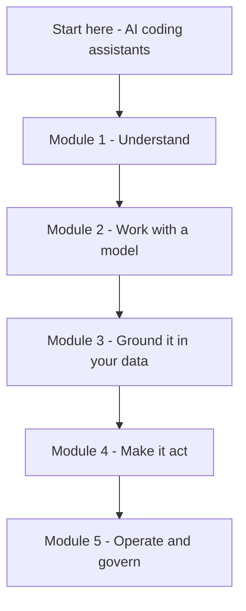

**Giai đoạn 0** là lớp nền tảng. Mục tiêu ở đây là chiều rộng, không phải chiều sâu: hiểu mỗi
khái niệm *là gì* và *khi nào* dùng. Chúng ta đi từ nền tảng đến nâng cao, phần giải thích sâu
hơn sẽ ở các giai đoạn sau.

Viết cho **builder kỹ thuật** — developer, AI/data engineer, DevSecOps, platform và solution
architect — những người muốn *dùng và áp dụng* AI, không phải huấn luyện mô hình. Ít đi sâu vào
ML/DL, tập trung vào những gì bạn cần để xây một cách tự tin.

## Học theo thứ tự nào

Đi theo năm module tuần tự — mỗi cái xây trên cái trước, từ *hiểu* mô hình đến *vận hành* chúng
trên production. Mới bắt đầu? Hãy xem
**[AI coding assistants]()** — các công cụ bạn
đã dùng — rồi vào Module 1.

### Module 1 · Understand

*Mục tiêu: biết các mô hình này là gì và hành xử ra sao.*

1. [The AI landscape]()
2. [Foundation models]()
3. [Generative AI]()
4. [How LLMs work]()
5. [How models are trained]()

### Module 2 · Work with a model

*Mục tiêu: gọi được model và kiểm soát đầu ra.*

1. [Choosing a model]()
2. [The AI API]()
3. [Inference parameters]()
4. [Prompt engineering]()
5. [Context engineering]()

### Module 3 · Ground it in your data

*Mục tiêu: khiến câu trả lời dùng dữ liệu của bạn, cập nhật.*

1. [Embeddings]()
2. [RAG]()

### Module 4 · Make it act

*Mục tiêu: cho model dùng tool và chạy như một agent.*

1. [Tool & function calling]()
2. [Agentic AI]()
3. [Agents]()
4. [MCP]()

### Module 5 · Operate & govern

*Mục tiêu: đưa lên production an toàn, đo được, có trách nhiệm.*

1. [Guardrails]()
2. [AI security]()
3. [Model evaluation]()
4. [Observability]()
5. [Responsible AI]()
