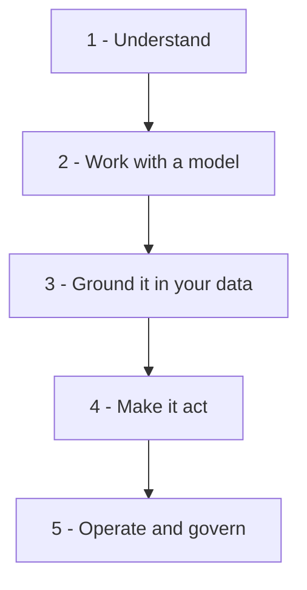

**Giai đoạn 0** là lớp nền tảng. Mục tiêu ở đây là chiều rộng, không phải chiều sâu: hiểu mỗi
khái niệm *là gì* và *khi nào* dùng, rồi đào sâu ở các giai đoạn sau.

Viết cho **builder kỹ thuật** — developer, AI/data engineer, DevSecOps, platform và solution
architect — những người muốn *dùng và áp dụng* AI, không phải huấn luyện mô hình. Ít đi sâu
vào ML/DL, tập trung vào những gì bạn cần để xây một cách tự tin.

## Năm module

Đi lần lượt — mỗi cái xây trên cái trước. Bắt đầu từ
**[The AI landscape]()** và theo sidebar; mỗi module liệt kê
các trang theo đúng thứ tự đọc.

```mermaid
flowchart TB
    M1[1 - Understand] --> M2[2 - Work with a model]
    M2 --> M3[3 - Ground it in your data]
    M3 --> M4[4 - Make it act]
    M4 --> M5[5 - Operate and govern]
```

1. **[Understand]()** — các mô hình này là gì và hành xử ra sao.
2. **[Work with a model]()** — gọi model và kiểm soát đầu ra.
3. **[Ground it in your data]()** — khiến câu trả lời dùng dữ liệu của bạn, cập nhật.
4. **[Make it act]()** — tools, agents, agentic AI, và MCP.
5. **[Operate & govern]()** — guardrails, security, đánh giá, observability, responsible AI.
