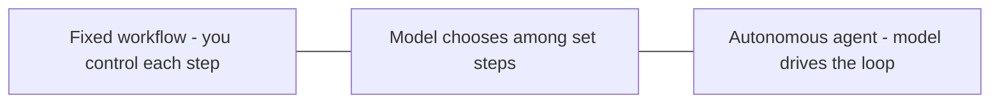
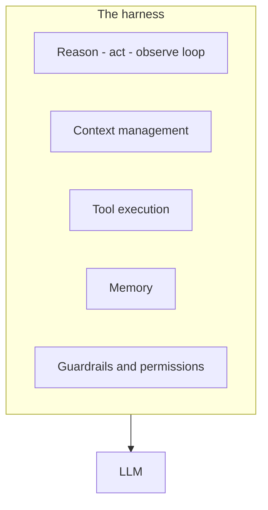

**Agentic** mô tả các hệ thống trong đó mô hình không chỉ trả lời — nó tự dẫn dắt các hành động
nhiều bước hướng tới mục tiêu, tự quyết định làm gì tiếp theo và dùng tool dọc đường.

## Workflow vs agent

Đây là một dải phổ về mức độ quyền bạn giao cho mô hình:

- **Workflow** — bạn code các bước; mô hình điền vào chỗ trống (extract, classify, summarize).
  Dễ đoán và rẻ.
- **Agent** — mô hình tự quyết các bước lúc chạy qua
  [vòng lặp reason → act → observe](). Linh hoạt nhưng khó đoán hơn.

Ưu tiên lựa chọn "bên trái" nhất mà vẫn giải quyết được bài toán. Agentic mạnh, nhưng không miễn phí.

## Cái harness

Một agent là mô hình **cộng với một harness** — phần scaffolding quanh nó giúp vòng lặp chạy được:

Mô hình là động cơ; harness là khung xe — nó chạy vòng lặp, quản lý
[context window](), thực thi
[tool call](), lưu memory, và thực thi
[guardrail]().

## Khi nào nên dùng agentic

- ✅ Tác vụ nhiều bước và khó script đầy đủ trước.
- ✅ Cần phản ứng theo kết quả trung gian (tìm, rồi quyết, rồi hành động).
- ❌ Một workflow cố định đã giải quyết được — đừng thêm quyền tự chủ không cần thiết.

## Đánh đổi

Càng nhiều tự chủ = càng mạnh, nhưng cũng càng tốn chi phí, độ trễ, và kém dễ đoán. Đó là lý do
[đánh giá]() và
[guardrail]() càng quan trọng khi bạn càng agentic.
