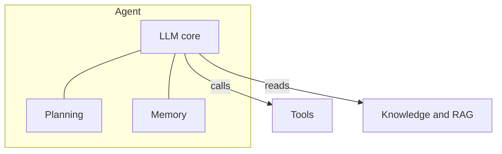
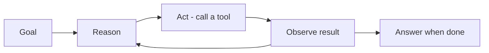

## Là gì

**Agent** là một foundation model có thể lập kế hoạch và thực hiện hành động để đạt mục tiêu,
thay vì chỉ trả về một câu trả lời duy nhất. Nó quyết định cần làm gì, gọi **công cụ (tools)**
như tìm kiếm, API, code, cơ sở dữ liệu, quan sát kết quả, và lặp lại đến khi hoàn thành.

## Các thành phần cốt lõi

- **Planning** — chia mục tiêu thành các bước và quyết định làm gì tiếp theo.
- **Tool use** — gọi hàm/API bên ngoài để hành động hoặc lấy dữ liệu.
- **Memory** — lưu ngữ cảnh xuyên suốt các bước (ngắn hạn và dài hạn).
- **Reflection** — đánh giá kết quả và điều chỉnh cách tiếp cận.

## Chat vs agent

- Một lời gọi **chat** thông thường: một prompt vào, một câu trả lời ra.
- Một **agent**: vòng lặp *suy nghĩ → hành động → quan sát*, có thể dùng công cụ và thực hiện nhiều bước.

## Khi nào nên dùng

- Tác vụ cần nhiều bước hoặc hành động bên ngoài (không chỉ sinh văn bản).
- Mô hình cần lấy dữ liệu mới hoặc thao tác trên hệ thống (tìm kiếm, code, API).
- Kết quả phụ thuộc vào các kết quả trung gian mà mô hình chưa biết trước.

> Càng nhiều quyền tự chủ thì càng mạnh — và càng cần **guardrail** và giám sát.
