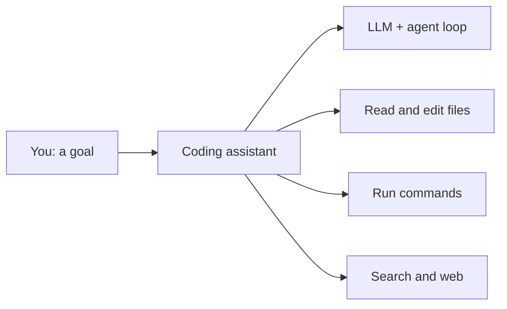

Nhiều khả năng bạn đã đang dùng một trong số này. Trang này là **cửa ngõ**: các công cụ đó thực
sự là gì, để phần còn lại của vault khớp vào đúng chỗ.

## Chúng là gì

AI coding assistant là một [agent]() cho công việc phần
mềm: một LLM được bọc trong một **harness** có thể đọc và sửa file, chạy lệnh, tìm kiếm, và dùng
tool — ngay trong editor hoặc terminal của bạn.

## Bức tranh (thay đổi rất nhanh)

- **Agent dòng lệnh / CLI** — Claude Code, OpenAI Codex CLI, Gemini CLI.
- **Agent trong editor / IDE** — Cursor, GitHub Copilot, Google Antigravity.
- **Agent cloud / bất đồng bộ** — chạy tác vụ trên server và mở pull request.

Chúng khác nhau về bề mặt và model, nhưng hình dạng thì như nhau: **model + harness + tool**.

## Bên dưới là gì

Mỗi công cụ đều được xây từ chính các khái niệm trong giai đoạn này:

- Một [foundation model]() đảm nhận suy luận.
- Một [harness / agent loop]() chạy *reason → act → observe*.
- [Tool & function calling]() cho phép nó sửa
  file và chạy lệnh.
- [Context engineering]() quyết định model thấy
  code và lịch sử nào.
- [MCP]() kết nối nó tới tool và dữ liệu bên ngoài.

## Vì sao điều này quan trọng với lộ trình của bạn

Hiểu các mảnh này giúp bạn **dùng công cụ tốt hơn** (mục tiêu rõ hơn, context tốt hơn, biết khi
nào chúng sẽ đuối) — và đó cũng chính là kiến thức bạn dùng để **tự build** agent và ứng dụng AI
ở [Giai đoạn 2](). Dùng là cửa ngõ; build là đích đến.
