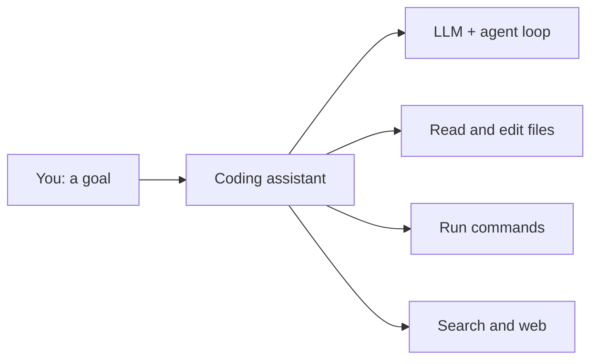

## Mục tiêu

Thấy các khái niệm của module này chạy trong một sản phẩm thật. AI coding assistant là agent
hoàn chỉnh nhất mà đa số builder chạm vào hằng ngày — hiểu bên trong giúp bạn *dùng* nó tốt
hơn, và đó cũng chính là kiến trúc bạn sẽ *xây* ở [Giai đoạn 2]().

## Chúng là gì

AI coding assistant là một [agent]() cho công việc phần
mềm: một LLM bọc trong **harness** có thể đọc và sửa file, chạy lệnh, tìm kiếm và dùng tool —
trong editor, terminal, hoặc dạng cloud agent tự mở pull request. Sản phẩm khác nhau (Claude
Code, Codex, Cursor, Copilot, Gemini CLI…), nhưng hình hài luôn giống nhau:
**model + harness + tools**.

```mermaid
flowchart LR
    You[You: a goal] --> A[Coding assistant]
    A --> M[LLM + agent loop]
    A --> F[Read and edit files]
    A --> C[Run commands]
    A --> W[Search and web]
```

## Bên trong có gì

Mỗi công cụ đều được lắp từ các khái niệm trong giai đoạn này:

- Một [foundation model]() đảm nhiệm suy luận.
- [Vòng lặp agent]() chạy *reason → act → observe*.
- [Tool & function calling]() cho phép nó
  sửa file và chạy lệnh.
- [Context engineering]() quyết định model
  thấy code và lịch sử nào.
- [MCP]() nối nó với tool và dữ liệu bên ngoài.

## Ví dụ — một tác vụ đi qua vòng lặp

Bạn nói: *"test login đang fail — sửa đi."*

1. **Act** — chạy test suite; **observe** — một assertion fail vì mock token hết hạn.
2. **Act** — đọc file test và module auth; **observe** — helper tạo token đang hardcode ngày.
3. **Act** — sửa helper để sinh ngày mới, chạy lại test; **observe** — xanh.
4. **Answer** — tóm tắt thay đổi và đưa diff.

Không bước nào được script sẵn — model tự chọn hành động từ những gì nó quan sát. Đó chính là
[vòng lặp agent](), áp vào code.

## Điểm mạnh & hạn chế

- **Điểm mạnh** — bền bỉ với việc cơ học trải nhiều file; tự kiểm chứng thay đổi bằng cách
  chạy test và lệnh; một mục tiêu rõ cộng context tốt thường thắng việc tự gõ tay.
- **Hạn chế** — chất lượng đi theo đầu vào *của bạn*: mục tiêu mơ hồ hoặc thiếu context sinh
  thay đổi sai một cách tự tin; yếu với tri thức ngầm chỉ nằm trong đầu bạn hoặc team; phiên
  dài xuống cấp khi context đầy. Bạn review diff — nó không tự ship gì cả.

## Nguồn

- [Anthropic — Building effective agents](https://www.anthropic.com/research/building-effective-agents)
- [Anthropic — Agent SDK overview](https://platform.claude.com/docs/en/agent-sdk/overview)
