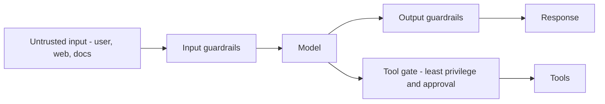

Tiếp nối [Guardrail](). Ứng dụng LLM thêm một bề mặt
tấn công mới: mô hình làm theo **chỉ dẫn bằng ngôn ngữ tự nhiên**, và nó không phân biệt đáng
tin được đâu là chỉ dẫn của bạn với chỉ dẫn của kẻ tấn công ẩn trong dữ liệu nó đọc.

## Vì sao nó khác

Bất kỳ văn bản nào mô hình thấy — tin nhắn người dùng, một trang web, tài liệu truy xuất, kết
quả tool — đều có thể *chứa chỉ dẫn*. Nếu mô hình coi văn bản của kẻ tấn công là lệnh, bạn gặp
một vấn đề mà không regex validate đầu vào nào bắt được.

## Các mối đe dọa chính

- **Prompt injection** — chỉ dẫn độc hại trong đầu vào. *Trực tiếp* (người dùng gõ vào) hoặc
  *gián tiếp* (ẩn trong trang web hay tài liệu mô hình truy xuất — loại nguy hiểm).
- **Jailbreak** — prompt vượt qua huấn luyện an toàn của mô hình.
- **Rò rỉ / exfiltration dữ liệu** — dụ mô hình tiết lộ bí mật, system prompt, hoặc dữ liệu của
  người dùng khác.
- **Excessive agency** — một agent có quyền tool rộng gây thiệt hại (xóa dữ liệu, gửi tin nhắn)
  khi bị thao túng.
- **Lộ PII** — dữ liệu cá nhân nhạy cảm chảy vào prompt, log, hoặc huấn luyện.
- **Supply chain** — mô hình, tool, hoặc MCP server không đáng tin.

## Phòng thủ

- **Least privilege cho tool** — cấp tối thiểu; chặn hành động phá hủy sau phê duyệt của con
  người (xem [Tool & function calling]()).
- **Coi nội dung truy xuất/tool là không đáng tin** — không bao giờ là chỉ dẫn. Tách rõ khỏi
  chỉ thị của bạn.
- **Guardrail đầu vào & đầu ra** — moderation, che PII, kiểm tra định dạng/grounding.
- **Không bao giờ đặt bí mật trong prompt** — chúng tồn tại trong lịch sử và log.
- **Phòng thủ nhiều lớp** — không bộ lọc đơn lẻ nào đủ; giả định injection đôi khi sẽ lọt và
  giới hạn phạm vi thiệt hại.
