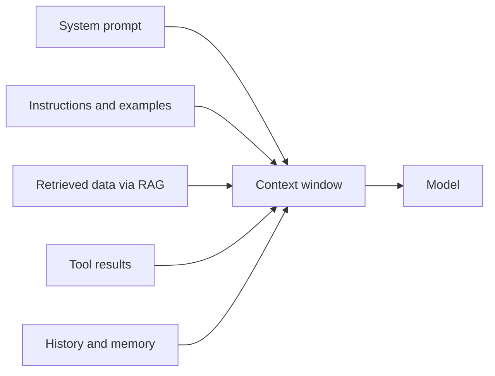

Tiếp nối [Prompt engineering](). Prompting là
*diễn đạt* yêu cầu; **context engineering** là quyết định *mọi thứ* mô hình nhìn thấy trong
[context window](/foundations/how-llms-work/) hữu hạn của nó — và những gì cần bỏ ra ngoài.

## Trong context có gì

- **System prompt** — vai trò, quy tắc, định dạng đầu ra.
- **Chỉ dẫn / ví dụ** — nhiệm vụ và các mẫu few-shot.
- **Dữ liệu truy xuất** — tài liệu kéo vào qua [RAG]().
- **Kết quả tool** — đầu ra từ [tool mà mô hình gọi]().
- **Lịch sử / memory** — các lượt trước, hoặc dữ kiện mang qua nhiều phiên.

## Vấn đề cốt lõi: window là hữu hạn

Mọi thứ ở trên cạnh tranh cùng một ngân sách token. Nhiều hơn không phải tốt hơn — context
không liên quan làm mô hình phân tâm và tốn tiền. Mục tiêu là thông tin **đúng**, không phải nhiều nhất.

## Kỹ thuật

- **Retrieval** — chỉ lấy các đoạn liên quan đến *request này* (RAG).
- **Summarization / compaction** — cô đọng các lượt cũ khi hội thoại dài ra.
- **Pruning** — bỏ các kết quả tool và lịch sử mô hình không còn cần.
- **Ordering & caching** — đặt nội dung ổn định lên trước để cache và tái dùng rẻ hơn.

## Vì sao điều này quan trọng với bạn

Phần lớn lỗi "mô hình trả lời sai" thật ra là lỗi context: nó thiếu thông tin đúng, hoặc chìm
trong thông tin sai. Sửa context trước khi đổ lỗi cho mô hình.
