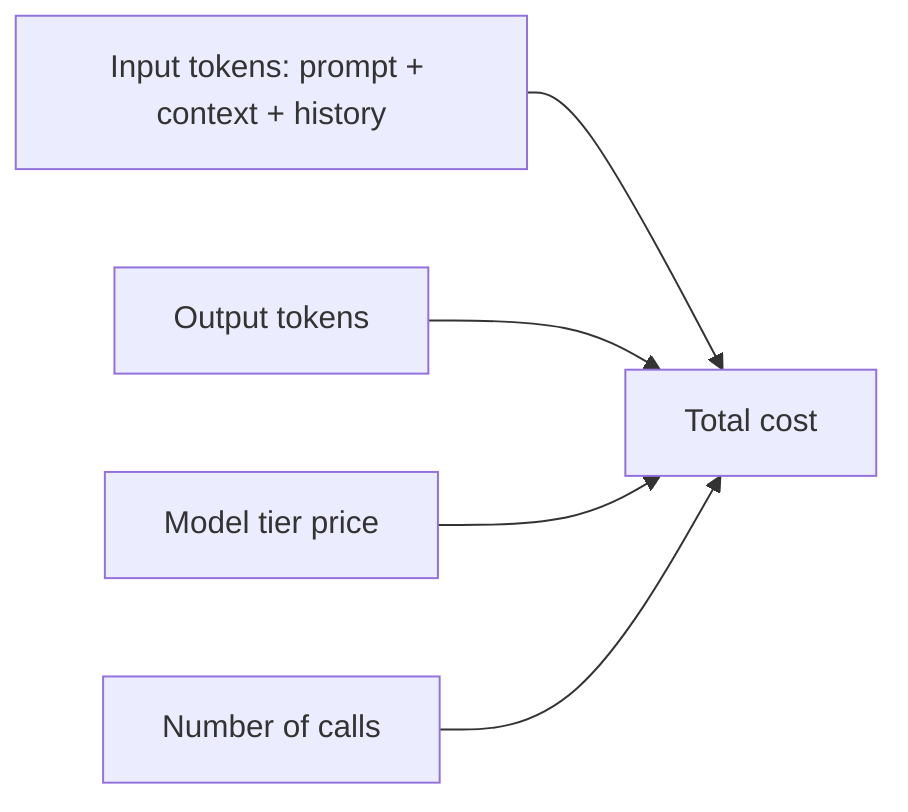

Bạn trả theo **token** — đầu vào và đầu ra, tính giá riêng. Chi phí dễ hình dung khi thấy điều gì
nuôi nó.

## Điều gì đẩy chi phí

- **Input tokens** — system prompt, [context]()
  truy xuất, và toàn bộ lịch sử hội thoại bạn gửi lại mỗi lượt.
- **Output tokens** — thường đắt hơn input.
- **Model tier** — model flagship có thể đắt gấp 10×+ model nhỏ (xem
  [Choosing a model]()).
- **Số lần gọi** — [agent]() nhân số lần gọi lên; một
  vòng lặp có thể là nhiều request cho mỗi tác vụ.

## Các đòn bẩy

- **Chọn đúng cỡ model** — dùng tier nhỏ hơn ở nơi chất lượng vẫn đạt.
- **Cắt gọn context** — chỉ gửi cái liên quan; đừng đổ cả tài liệu.
- **Giới hạn `max_tokens`** — chặn độ dài đầu ra.
- **Prompt caching** — tái dùng phần prefix ổn định giữa các lần gọi để giảm chi phí input.
- **Batch** cho việc offline; **stream** cho UX (không giảm chi phí, cải thiện độ trễ cảm nhận).

## Ước lượng và theo dõi

- Đếm token bằng tokenizer trước khi ship (đừng đoán).
- Theo dõi token thật trong [Observability]() — API
  trả về `usage` ở mỗi response.

> Quy tắc: token rẻ nhất là token bạn không gửi. Đa số vấn đề chi phí thật ra là vấn đề context.
