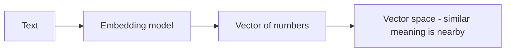

**Embedding** biến văn bản (hoặc hình ảnh, âm thanh) thành một dãy số — một **vector** — thể
hiện *ý nghĩa* của nó. Đây là cơ chế đằng sau [RAG](), nhưng
hữu ích rộng hơn nhiều.

## Ý tưởng cốt lõi

Văn bản gần nghĩa ánh xạ tới các vector **ở gần nhau**; văn bản không liên quan thì ở xa. "cat"
và "kitten" nằm cạnh nhau; "car" nằm ở chỗ khác. Cả mẹo nằm ở đó — ý nghĩa trở thành khoảng
cách bạn đo được.

## Cách dùng

- Dùng **cùng một embedding model** cho mọi thứ bạn so sánh — vector từ các model khác nhau
  không so sánh được.
- Đo độ gần bằng **cosine similarity** (góc giữa các vector).
- Lưu và tìm chúng trong một **vector database** (xem [RAG]()).

## Ứng dụng ngoài RAG

- **Semantic search** — tìm theo ý nghĩa, không theo từ khóa.
- **Clustering** — tự động gom nhóm các mục tương tự.
- **Classification** — gán nhãn văn bản theo ví dụ đã biết gần nhất.
- **Deduplication** — phát hiện nội dung gần trùng.
- **Recommendations** — "gợi ý thứ tương tự".

## Lưu ý thực tế

- **Số chiều** — vector có độ dài cố định (ví dụ hàng trăm đến hàng nghìn số); nhiều hơn không
  phải lúc nào cũng tốt hơn.
- **Chọn model** quan trọng — chọn cái phù hợp ngôn ngữ và lĩnh vực của bạn.
- Embedding **rẻ** so với generation; embedding cả một kho tài liệu là chuyện thường.
