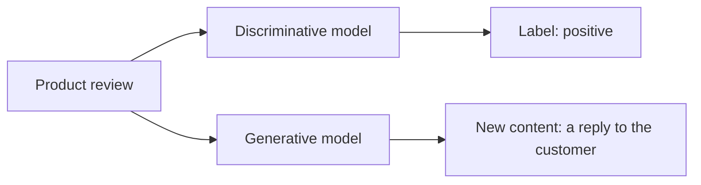

## Mục tiêu

Nắm chắc một phân biệt: mô hình **tạo ra** nội dung khác với mô hình **gán nhãn** nội dung.
Nghe học thuật nhưng nó quyết định kiến trúc thật: bài toán nào cần LLM, bài toán nào giải rẻ
hơn bằng cách khác.

## Generative vs discriminative

- Mô hình **discriminative** map input → nhãn hoặc điểm: spam / không-spam, rủi ro gian lận
  0.83, tích cực / tiêu cực.
- Mô hình **generative** map input → *nội dung mới*: văn bản, hình ảnh, âm thanh, video, code.

Cùng một input, hai việc khác nhau: mô hình discriminative *gán nhãn* review; mô hình
generative *viết câu trả lời*.

## Vì sao phân biệt này quan trọng với builder

- **Không phải bài toán nào cũng cần sinh nội dung.** Phân loại ticket, chấm điểm lead, phát
  hiện gian lận — đều là việc discriminative. LLM làm được (và là cách prototype nhanh), nhưng
  một classifier nhỏ thường rẻ hơn, nhanh hơn và dễ đoán hơn ở quy mô lớn.
- **Output generative mang tính xác suất** — cùng prompt có thể ra câu trả lời khác nhau. Tuyệt
  cho viết nháp và brainstorm; là rủi ro khi chỉ có đúng một đáp án, và đó là lý do
  [structured outputs]() và
  [đánh giá]() tồn tại.
- **Sinh nội dung là thay đổi về giao diện.** Trước GenAI, ML đưa bạn dự đoán để xây UI quanh
  nó; giờ model tạo ra chính sản phẩm — email, code, bản tóm tắt.

## Điểm mạnh & hạn chế

- **Điểm mạnh** — một model phủ viết nháp, tóm tắt, dịch, code, brainstorm; không cần huấn
  luyện theo tác vụ — một prompt là đổi được hành vi.
- **Hạn chế** — output đổi giữa các lần chạy; nó tối ưu cho *nghe hợp lý*, không phải *đúng*
  (xem [Limitations]()); với việc gán nhãn thuần ở
  quy mô lớn, nó có thể là cách đắt để làm một việc rẻ.

> Foundation model là động cơ; generative AI là việc chúng làm khi tạo nội dung.

## Nguồn

- [Google Cloud — What is Generative AI?](https://cloud.google.com/use-cases/generative-ai)
