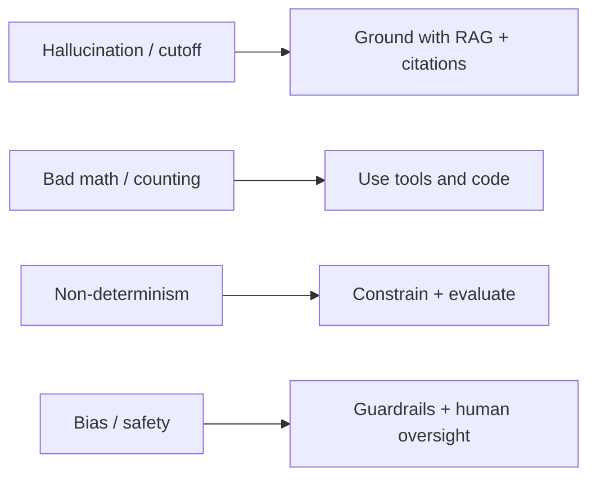

Biết *mô hình sai thế nào* cho bạn biết *cần thêm gì* quanh nó. Không cái nào là "bug" — chúng
đến từ chính [cách LLM hoạt động]().

## Các kiểu lỗi chính

| Kiểu lỗi | Là gì | Giảm thiểu |
| ---------- | ------- | ------------ |
| Hallucination | Tự tin nhưng sai hoặc không có căn cứ | [RAG]() + trích dẫn; cho phép "không biết" |
| Knowledge cutoff | Không biết dữ kiện mới hoặc riêng tư | RAG, tool, web search |
| Kém toán / đếm chính xác | Dự đoán token hợp lý, không tính toán | Cho nó [tool / code]() |
| Non-determinism | Cùng prompt → câu trả lời khác nhau | Hạ temperature, ràng buộc đầu ra, [đánh giá]() |
| Nhạy với prompt | Đổi chữ nhỏ cũng lệch kết quả | Test prompt trên bộ eval |
| Bias | Phản ánh thiên lệch trong dữ liệu huấn luyện | [Responsible AI](), giám sát của con người |
| Giới hạn context | Quên/rớt thông tin ngoài window | [Context engineering]() |

## Mô hình chung

## Điều rút ra

Một mô hình đứng một mình thì không đáng tin cho dữ kiện, toán, và tính nhất quán. Bạn làm nó
đáng tin bằng cách **bao quanh nó** — neo vào dữ liệu, cho tool, ràng buộc đầu ra, và đo lường.
Đó chính là nội dung của phần còn lại trong giai đoạn này.
