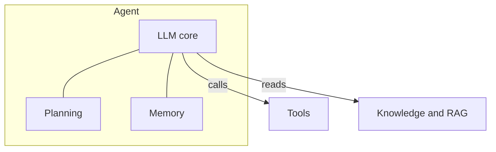
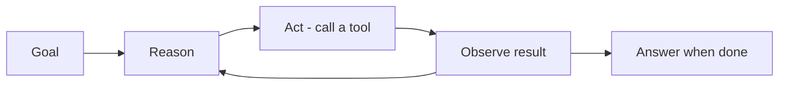

## Là gì

**Agent** là một foundation model có thể lập kế hoạch và thực hiện hành động để đạt mục tiêu,
thay vì chỉ trả về một câu trả lời duy nhất. Nó quyết định cần làm gì, gọi **công cụ (tools)**
như tìm kiếm, API, code, cơ sở dữ liệu, quan sát kết quả, và lặp lại đến khi hoàn thành.

## Các thành phần cốt lõi

- **Planning** — chia mục tiêu thành các bước và quyết định làm gì tiếp theo.
- **Tool use** — gọi hàm/API bên ngoài để hành động hoặc lấy dữ liệu.
- **Memory** — lưu ngữ cảnh xuyên suốt các bước (ngắn hạn và dài hạn).
- **Reflection** — đánh giá kết quả và điều chỉnh cách tiếp cận.

## Vòng lặp agent

Một lời gọi chat thường là một prompt vào, một câu trả lời ra. Agent thì chạy một vòng lặp —
*reason → act → observe* — cho đến khi đạt mục tiêu:

## Ví dụ — một lượt dùng tool

Câu hỏi: *"Thời tiết ở Paris thế nào?"*

1. **Reason** — cần thời tiết hiện tại; mình có tool `get_weather`.
2. **Act** — gọi `get_weather("Paris")`.
3. **Observe** — tool trả về `18°C, mưa`.
4. **Answer** — "Paris đang 18°C và có mưa."

Một lời gọi chat thường không làm được bước 2–3 — nó sẽ chỉ đoán.

## Khi nào nên dùng

- Tác vụ cần nhiều bước hoặc hành động bên ngoài (không chỉ sinh văn bản).
- Mô hình cần lấy dữ liệu mới hoặc thao tác trên hệ thống (tìm kiếm, code, API).
- Kết quả phụ thuộc vào các kết quả trung gian mà mô hình chưa biết trước.

Nên trao bao nhiêu phần của vòng lặp cho model — hay tự script các bước — là một quyết định
riêng: xem [Agentic AI]().

## Điểm mạnh & hạn chế

- **Điểm mạnh** — xử lý được các tác vụ không thể script trước hoàn toàn; hành động trên dữ
  liệu mới và hệ thống thật thay vì đoán; ghép được với mọi thứ khác trong vault này (tool,
  RAG, memory).
- **Hạn chế** — mỗi bước lặp là một lần gọi model, nên chi phí và độ trễ nhân lên; hành vi
  khó đoán hơn workflow cố định, và lỗi tích lũy qua các bước — vì thế
  [guardrails](), điều kiện dừng, và
  [đánh giá]() quan trọng ở đây hơn bất cứ đâu.

## Nguồn

- Yao et al., *ReAct: Synergizing Reasoning and Acting in Language Models* (2022) — [arXiv:2210.03629](https://arxiv.org/abs/2210.03629)
- [Anthropic — Building effective agents](https://www.anthropic.com/research/building-effective-agents)
