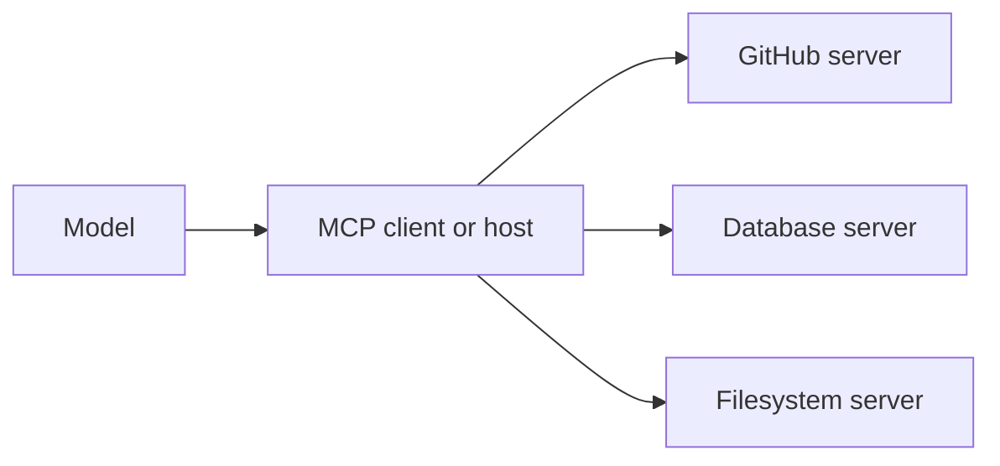

**MCP (Model Context Protocol)** là một chuẩn mở để kết nối mô hình với tool và dữ liệu bên
ngoài. Hãy xem nó như một "phích cắm" chung: thay vì đấu nối thủ công từng tích hợp, bạn kết
nối tới các MCP server bày ra năng lực theo một khuôn dạng chuẩn.

## Vấn đề nó giải quyết

Trước MCP, mỗi ứng dụng tự đấu nối [tool]() và
nguồn dữ liệu theo cách riêng. N ứng dụng × M tích hợp nghĩa là xây đi xây lại cùng những
connector. MCP chuẩn hoá giao diện để một tích hợp được viết **một lần** và tái dùng bởi mọi
ứng dụng tương thích MCP.

## Cách ghép lại với nhau

- **MCP server** — bày ra năng lực (server GitHub, server database, server filesystem, …).
- **MCP client / host** — ứng dụng hoặc agent kết nối tới các server và đưa năng lực của chúng
  cho mô hình.

Một server có thể bày ra ba thứ:

- **Tools** — hàm mô hình có thể gọi (xem [Tool & function calling]()).
- **Resources** — dữ liệu/context mô hình có thể đọc (file, bản ghi).
- **Prompts** — mẫu prompt tái sử dụng.

## Vì sao điều này quan trọng với bạn

- **Tái dùng thay vì xây lại** — kết nối tới một server có sẵn thay vì viết connector.
- **Tính di động** — cùng một server chạy được trên mọi client tương thích MCP.
- **Là xương sống của hệ sinh thái** — nhiều "connector", "skill" và "plugin" bên dưới là MCP server.

Xây server của riêng bạn là chủ đề Giai đoạn 2 — xem
[Tooling & frameworks]().

## Điểm mạnh & hạn chế

- **Điểm mạnh** — một tích hợp viết một lần, tái dùng ở mọi app tương thích MCP; catalog server
  làm sẵn ngày càng lớn; một khuôn dạng chuẩn (tools, resources, prompts) thay vì keo dán riêng
  cho từng app.
- **Hạn chế** — mỗi server bạn kết nối **mở rộng bề mặt tấn công**: server độc hại hoặc bị chiếm
  quyền có thể nhét chỉ dẫn cho model hoặc rò rỉ những gì model gửi sang (mối đe dọa supply
  chain trong [AI security]()); quyền hạn thường thô
  hơn mức tác vụ cần — ưu tiên server có scope hẹp; và chuẩn còn trẻ, chi tiết auth và
  transport vẫn đang hoàn thiện.

## Nguồn

- [Model Context Protocol — Introduction](https://modelcontextprotocol.io)
- [Model Context Protocol — Specification (2025-06-18)](https://modelcontextprotocol.io/specification/2025-06-18)
