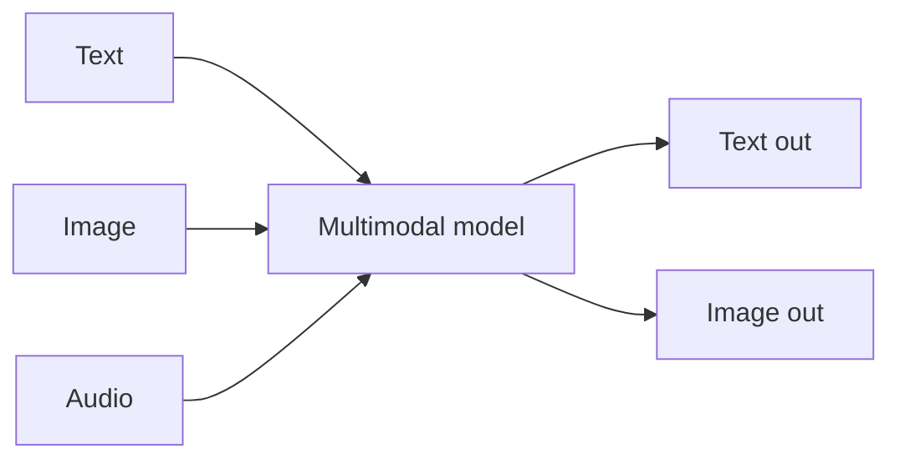

Mô hình hiện đại không chỉ có text. Một mô hình **đa phương thức (multimodal)** có thể nhận — và
đôi khi tạo ra — hình ảnh, âm thanh, video bên cạnh văn bản. Nhiều công cụ bạn dùng (coding agent
đọc ảnh chụp màn hình, chat "nhìn" được ảnh) đều dựa vào điều này.

## Phương thức đầu vào vs đầu ra

- **Vision** — ảnh *vào*, text ra (mô tả biểu đồ, đọc ảnh màn hình, trích xuất từ PDF).
- **Image generation** — text *vào*, ảnh ra.
- **Speech** — audio ↔ text (phiên âm, giao diện giọng nói).

Mỗi mô hình hỗ trợ một tập cụ thể — hãy kiểm tra trước khi phụ thuộc vào nó.

## Vì sao quan trọng với builder

- Biến **ảnh màn hình hoặc thiết kế** thành code.
- **Hiểu tài liệu / PDF** — hóa đơn, biểu mẫu, sơ đồ.
- **Đọc biểu đồ & bảng** để trích xuất dữ liệu.
- Giao diện **giọng nói** qua speech-to-text và text-to-speech.

## Lưu ý thực tế

- Bạn gửi ảnh **trong cùng `messages`** với text (xem [The AI API]()).
- Ảnh cũng tốn **token** — thường khá nhiều; độ phân giải cao = nhiều token hơn.
- Một mô hình đa phương thức thì tiện; mô hình chuyên biệt có thể tốt hoặc rẻ hơn cho một
  phương thức duy nhất. Đây là đánh đổi khi [chọn model]().
