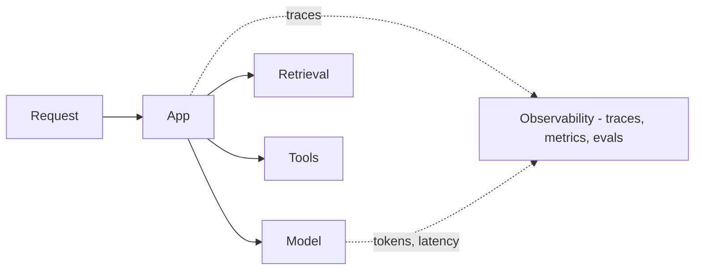

Tiếp nối [Model evaluation](). Đánh giá hỏi *nó
có tốt không?*; **observability** hỏi *thực tế đã xảy ra gì trên production, và vì sao?* Vì đầu
ra mang tính bất định, bạn không thể debug một hệ thống AI mà bạn không nhìn thấy bên trong.

## Cần thu thập gì

- **Trace** — toàn bộ diễn tiến từng bước của một request: prompt, context truy xuất, mỗi tool
  call và kết quả, và đầu ra cuối. Đây là thứ bạn replay khi có sự cố.
- **Metric** — độ trễ, lượng token, **chi phí**, và tỉ lệ lỗi / từ chối theo thời gian.
- **Tín hiệu chất lượng** — phản hồi người dùng (thích/không thích), tỉ lệ hoàn thành, và
  **online eval** (chấm một mẫu lưu lượng thật, thường bằng
  [LLM-as-judge]()).

## Vì sao quan trọng

- **Debug** — một câu trả lời tệ có thể đến từ retrieval, prompt, tool, hoặc mô hình; chỉ trace
  mới cho biết là cái nào.
- **Kiểm soát chi phí** — token là tiền; bạn không quản được thứ bạn không đo.
- **Drift** — chất lượng có thể đổi khi dữ liệu, prompt, hoặc version mô hình đổi; online eval
  bắt được điều đó.

## Offline vs online

Offline eval (trong [CI]()) bắt regression
trước khi ship; observability bắt những gì người dùng thật gặp *sau đó*. Bạn cần cả hai.
