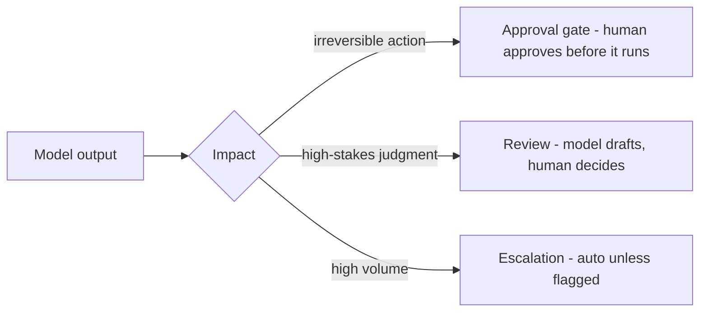

## Mục tiêu

Quyết định **mức tự chủ** của một tính năng AI dựa trên tác động của nó — và giữ đủ bằng chứng
để giải thích được mọi quyết định về sau. Responsible AI không phải một tài liệu chính sách;
nó là một tập các quyết định thiết kế: con người đứng ở đâu trong vòng lặp, log những gì, và
kiểm thử gì trước khi ra mắt.

## Mức tự chủ tương xứng với tác động

| Tác động khi output sai | Ví dụ | Mẫu thiết kế |
| ------ | ------ | ------ |
| **Thấp** — nội bộ, đảo ngược được | gợi ý code, email nháp, tóm tắt cuộc họp | Tự chủ hoàn toàn; log để debug |
| **Trung bình** — nội dung tới người dùng | câu trả lời support, mô tả sản phẩm | Tự chủ + [guardrails](); review theo mẫu |
| **Cao** — tiền, quyền lợi hoặc sức khỏe của một con người | sàng lọc tuyển dụng, hạn mức tín dụng, phân loại y tế | AI hỗ trợ; **con người ra quyết định cuối** |

Các quy định pháp lý cũng hội tụ về đúng ý này: EU AI Act phân loại hệ thống theo bậc rủi ro,
NIST AI RMF đóng khung công việc là nhận diện và quản lý rủi ro — cả hai đều xuất phát từ
*tác động*, không phải từ công nghệ.

## Ba cách đặt con người vào vòng lặp

- **Approval gate** — model *đề xuất* hành động; con người duyệt trước khi nó chạy. Cho các
  tác động không đảo ngược được hoặc hướng ra ngoài: chuyển tiền, xóa dữ liệu, gửi email cho
  khách hàng.
- **Review** — model viết nháp; con người hoàn thiện và chịu trách nhiệm kết quả. Cho các phán
  đoán rủi ro cao: shortlist tuyển dụng, câu chữ pháp lý, tư vấn y tế.
- **Escalation** — hệ thống tự chạy mặc định, chỉ chuyển cho con người khi guardrail bắt hoặc
  độ tin cậy thấp. Cho khối lượng lớn: bot support, kiểm duyệt nội dung. Rẻ nhất trong ba
  cách, nhưng chỉ tốt bằng đúng cái trigger của nó.

## Ví dụ — sàng lọc tuyển dụng làm đúng cách

AI xếp hạng 500 hồ sơ ứng tuyển. Phiên bản có trách nhiệm trông thế này:

- Model đưa ra shortlist **kèm lý do**; nhà tuyển dụng ra quyết định cuối (mẫu review).
- Trước khi ra mắt, team so sánh thứ hạng giữa các nhóm trên một bộ eval (**bias testing**):
  nó có âm thầm hạ điểm nhóm nào không?
- Mỗi lần sàng lọc đều log phiên bản model và prompt, input, output, và ai đã duyệt — để về
  sau tái dựng được kết quả của bất kỳ ứng viên nào.

## Log gì để audit được

Câu hỏi audit là *"vì sao hệ thống quyết định như vậy, với người này, vào ngày đó?"* Bạn chỉ
trả lời được nếu mỗi quyết định ghi lại:

- **Model đã thấy gì** — input cộng với context được truy xuất.
- **Cái gì tạo ra nó** — phiên bản model và prompt.
- **Cái gì đi ra** — output, độ tin cậy, phán quyết của guardrail.
- **Ai đã ký duyệt** — quyết định của con người, nếu có, và họ đã sửa gì.

Đây chính là bộ máy của [observability](); khác
biệt nằm ở thời gian lưu và mục đích. Trace debug là cho bạn — log audit phải tồn tại lâu dài
và người ngoài đọc phải hiểu được.

## Transparency, explainability, interpretability

Ba thuật ngữ hay bị lẫn. **Transparency** là công khai cách hệ thống được xây và đánh giá.
**Explainability** là giải thích được một output *cụ thể* — với hệ thống LLM, thường nghĩa là
hiển thị nguồn, đó là một lý do citation trong RAG quan trọng. **Interpretability** là hiểu
được bên trong mô hình — hiếm khi khả thi với LLM, và chính vì thế hai cái còn lại phải gánh
phần việc.

Hallucination, toxicity và prompt injection được xử lý ở đúng nơi chống lại chúng:
[limitations](),
[guardrails](), và
[AI security]().

## Điểm mạnh & hạn chế (của giám sát con người)

- **Điểm mạnh** — bắt được những lỗi tự động hóa không nhìn thấy (ngữ cảnh, công bằng, ca
  hiếm); tạo trách nhiệm giải trình đứng vững qua audit; là thứ khiến AI dùng được trong các
  lĩnh vực có quản lý ngay từ đầu.
- **Hạn chế** — tốn độ trễ và throughput; reviewer duyệt cho có khi khối lượng lớn
  (**automation bias**) — hãy đo tần suất họ bác model, vì tỷ lệ override 0% nghĩa là review
  không có thật; giám sát đặt khắp nơi làm cùn sự chú ý ở chỗ quan trọng — đặt cổng theo tác
  động, đừng đặt mặc định.

## Nguồn

- [NIST — AI Risk Management Framework (AI RMF 1.0)](https://www.nist.gov/itl/ai-risk-management-framework)
- [NIST — AI RMF: Generative AI Profile](https://www.nist.gov/publications/artificial-intelligence-risk-management-framework-generative-artificial-intelligence)
- [EU — Artificial Intelligence Act (Regulation 2024/1689)](https://eur-lex.europa.eu/eli/reg/2024/1689/oj)
