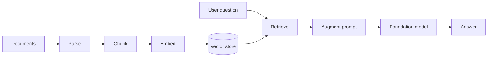

## Mục tiêu

Mục tiêu của **RAG** là truy xuất thông tin liên quan từ nguồn dữ liệu bên ngoài và bổ sung
thông tin đó vào prompt trước khi foundation model tạo câu trả lời. Nhờ vậy, mô hình có thể trả
lời dựa trên dữ liệu của doanh nghiệp thay vì chỉ dựa vào kiến thức đã được học trong quá trình
huấn luyện.

## Pipeline cơ bản

Thu thập tài liệu → parse → chia thành chunks → tạo embeddings → lưu vào vector store → truy
xuất → augmentation → generation.

| Bước | Vai trò |
| ------ | --------- |
| Parse | Đọc và trích xuất nội dung từ PDF, Word, HTML hoặc các nguồn khác |
| Chunking | Chia tài liệu thành các đoạn nhỏ để việc truy xuất chính xác hơn |
| Embedding | Chuyển văn bản thành vector số thể hiện ý nghĩa ngữ nghĩa |
| Vector store | Lưu trữ và lập chỉ mục embeddings |
| Retrieval | Tìm những đoạn tài liệu liên quan nhất đến câu hỏi của người dùng |
| Augmentation | Đưa nội dung được truy xuất vào prompt làm context |
| Generation | Foundation model sử dụng context để tạo câu trả lời |

## Embeddings

**Embedding** là quá trình chuyển văn bản thành vector số thể hiện ý nghĩa ngữ nghĩa — văn bản
gần nghĩa thì vector gần nhau. Dùng **cùng một embedding model** cho cả tài liệu và câu truy vấn;
độ liên quan đo bằng **cosine similarity**.

## Vector database

**Vector store** được dùng để lưu trữ và lập chỉ mục embeddings, và thực hiện **similarity
search** (thường dùng xấp xỉ láng giềng gần nhất để tăng tốc). Ví dụ: pgvector, FAISS, Pinecone,
Chroma, Weaviate.

## Khi nào nên sử dụng RAG

- Dữ liệu nội bộ thường xuyên thay đổi.
- Cần trả lời dựa trên tài liệu doanh nghiệp.
- Cần dẫn nguồn hoặc lưu lại tài liệu tham khảo.
- Muốn giảm hallucination bằng cách cung cấp context đáng tin cậy.
- Không muốn huấn luyện lại mô hình mỗi khi dữ liệu thay đổi.
- Cần kiểm soát phạm vi kiến thức mà mô hình được sử dụng.

## RAG vs fine-tuning

Ví dụ, một doanh nghiệp có hàng nghìn tài liệu hướng dẫn sản phẩm được cập nhật mỗi tuần. Nếu
dùng fine-tuning để bổ sung kiến thức, doanh nghiệp có thể phải huấn luyện lại mô hình mỗi khi
tài liệu thay đổi. Với RAG, doanh nghiệp chỉ cần cập nhật nguồn dữ liệu và đồng bộ lại embeddings.
