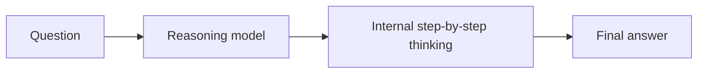

**Reasoning model** là mô hình được huấn luyện để xử lý bài toán từng bước *trước khi* đưa ra câu
trả lời cuối — đánh đổi thời gian và token để lấy độ chính xác cho các tác vụ khó, nhiều bước.

## Nó xuất hiện thế nào

Mỗi nhà cung cấp bày ra khác nhau, nhưng hình dạng như nhau: một núm **thinking / effort** bạn
vặn lên cho bài khó hơn (ví dụ "extended"/"adaptive" thinking, một mức *effort*, hoặc một mô
hình reasoning riêng). Effort càng cao → suy luận nội bộ càng nhiều → chậm hơn và đắt hơn.

## Khi nào nên dùng

- ✅ Suy luận phức tạp, toán, lập kế hoạch, debug nhiều bước.
- ✅ Tác vụ [agentic]() nhiều bước.
- ❌ Tra cứu đơn giản, phân loại, hoặc gọi khối lượng lớn/nhạy độ trễ — model nhanh rẻ hơn và đủ tốt.

## Đánh đổi

| | Model nhanh | Reasoning model |
| -- | ------------ | ----------------- |
| Tốc độ | Nhanh | Chậm hơn |
| Chi phí | Thấp hơn | Cao hơn (nhiều token) |
| Giỏi nhất ở | Tác vụ đơn giản, rõ phạm vi | Bài khó, nhiều bước |

Chọn giữa hai loại là quyết định [chọn model]();
núm effort là một trong các [inference parameters]().
