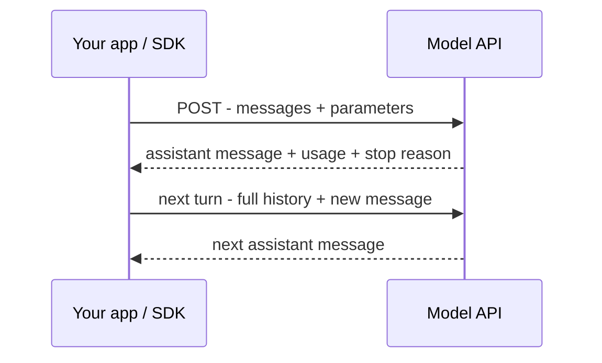

Mọi thứ bạn build đều nói chuyện với model qua một **API**: bạn gửi messages qua HTTP và nhận
lại một phản hồi được sinh ra. Đa số nhà cung cấp dùng chung một hình dạng, nên các khái niệm ở
đây chuyển giao được.

## Chu trình request/response



## Request

Bạn gửi id model, cuộc hội thoại dưới dạng danh sách **messages**, và vài
[tham số]():

```json
{
  "model": "<model-id>",
  "max_tokens": 1024,
  "messages": [
    { "role": "system", "content": "You are a helpful assistant." },
    { "role": "user", "content": "Summarize this in one sentence: ..." }
  ]
}
```

## Ba vai trò (roles)

- **system** — chỉ dẫn cố định: model là ai, quy tắc, định dạng đầu ra.
- **user** — đầu vào từ người dùng hoặc app của bạn.
- **assistant** — các lượt trả lời của chính model. Trong hội thoại nhiều lượt, bạn gửi lại các
  lượt *assistant trước đó* để nó "nhớ".

## Response

```json
{
  "role": "assistant",
  "content": "The document argues that ...",
  "usage": { "input_tokens": 812, "output_tokens": 24 },
  "stop_reason": "end_turn"
}
```

- **content** — văn bản sinh ra (hoặc lời gọi tool — xem
  [Tool & function calling]()).
- **usage** — token vào/ra, đây là thứ bạn bị tính phí.
- **stop_reason** — vì sao nó dừng (xong, chạm `max_tokens`, cần gọi tool, …).

## Streaming

Thay vì chờ cả câu trả lời, bạn có thể **stream** token khi chúng được sinh ra — UX tốt hơn
nhiều cho đầu ra dài, và tránh timeout request.

## Stateless — bạn phải gửi lại lịch sử

API **không có bộ nhớ** giữa các lần gọi. Mỗi request phải kèm toàn bộ cuộc hội thoại bạn muốn
model thấy; quản lý việc đó là [context engineering]().

## SDK

Bạn hiếm khi tự viết HTTP. Mỗi nhà cung cấp phát hành một **SDK** (thư viện) bọc các lời gọi này
theo ngôn ngữ của bạn. Tên trường chính xác khác nhau theo nhà cung cấp — còn khái niệm (messages,
roles, usage, streaming) thì không.
