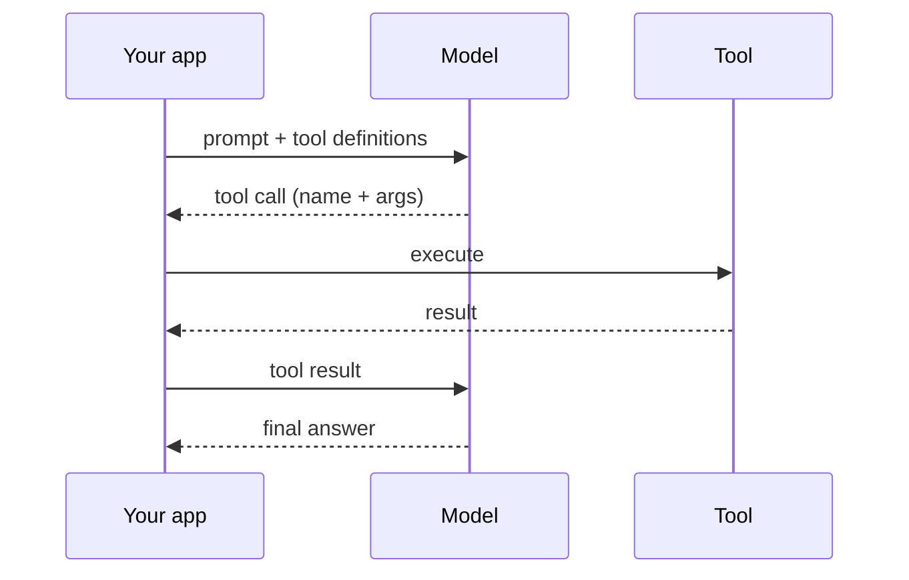

Đây là nguyên thủy biến một bộ sinh văn bản thành thứ có thể *hành động*. Agent, skill, plugin
và MCP đều xây trên nó.

## Ý tưởng

Bạn cho mô hình một danh sách **tool** (hàm) mà nó được phép gọi. Khi cần dùng để trả lời, mô
hình không tự chạy — nó trả về một yêu cầu gọi tool có cấu trúc, kèm tham số. **Code của bạn
chạy hàm** và đưa kết quả lại. Mô hình tiếp tục với kết quả đó trong tay.

## Vòng lặp

1. Bạn gửi prompt **kèm** định nghĩa tool.
2. Mô hình trả lời hoặc bằng câu trả lời, hoặc bằng một **tool call** (tên + tham số).
3. Code của bạn thực thi tool và trả về **kết quả**.
4. Mô hình dùng kết quả để trả lời — hoặc gọi tool khác. Lặp đến khi xong.

Chu trình yêu cầu → gọi → kết quả → tiếp tục này chính là thứ mà một
[agent]() tự động hoá.

## Định nghĩa một tool

Một tool được khai báo với **name**, một **description** (mô hình dùng cái này để quyết định
khi nào gọi), và một **input schema** (tham số có kiểu). Tên và mô tả rõ ràng quan trọng hơn
mọi thứ — đó là cách mô hình chọn đúng tool.

## Điểm chính

- **Mô hình không bao giờ tự thực thi** — nó chỉ *yêu cầu* gọi; phía bạn chạy chúng và là ranh
  giới an toàn.
- **Gọi song song** — mô hình có thể yêu cầu nhiều tool cùng lúc; trả về tất cả kết quả cùng nhau.
- **Validate đầu vào và chặn hành động rủi ro** (xem [Guardrail]());
  tham số mô hình yêu cầu là không đáng tin.
- **Structured output** là ý tưởng anh em: ràng buộc *câu trả lời* theo một schema, giống như
  tham số tool được ràng buộc.

> Skill, plugin và [MCP]() đều là cách *cung cấp* tool (và
> context) cho mô hình — cơ chế gọi bên dưới chính là cái này.
