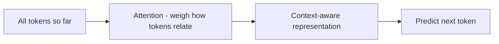

Tiếp nối [How LLMs work](). Bạn không cần cái này để
build, nhưng một mô hình tư duy nhẹ về *bên trong có gì* sẽ giải thích nhiều hành vi bạn gặp.

## Attention, gói trong một ý

LLM là **transformer**. Mẹo cốt lõi là **attention**: để dự đoán token kế tiếp, mô hình nhìn
*tất cả* token đến hiện tại và cân xem mỗi token quan trọng bao nhiêu với bước hiện tại. "It"
được nối với danh từ nó ám chỉ; một câu hỏi được nối với dữ kiện liên quan ở phía trước prompt.

## Vì sao điều này giải thích hành vi bạn thấy

- **Context là tất cả** — mô hình không có bộ nhớ ngoài những gì trong window; attention làm việc
  đúng trên đoạn text đó. Context liên quan nhiều hơn → câu trả lời tốt hơn (và tốn hơn).
- **Thứ tự và cách diễn đạt quan trọng** — attention nhạy với cách viết và vị trí; đó là vì sao
  [prompting]() và
  [context engineering]() hiệu quả.
- **Chi phí tăng theo độ dài** — attention so từng token với nhau, nên đầu vào dài đắt lên không cân xứng.
- **Không thực sự "hiểu"** — đây là dự đoán mẫu, không phải thấu hiểu, nên mô hình có thể sai một
  cách tự tin (xem [Limitations]()).

Đó là toàn bộ mục đích trang này — để nhận biết, không phải để cài đặt. Phần toán là tùy chọn.
