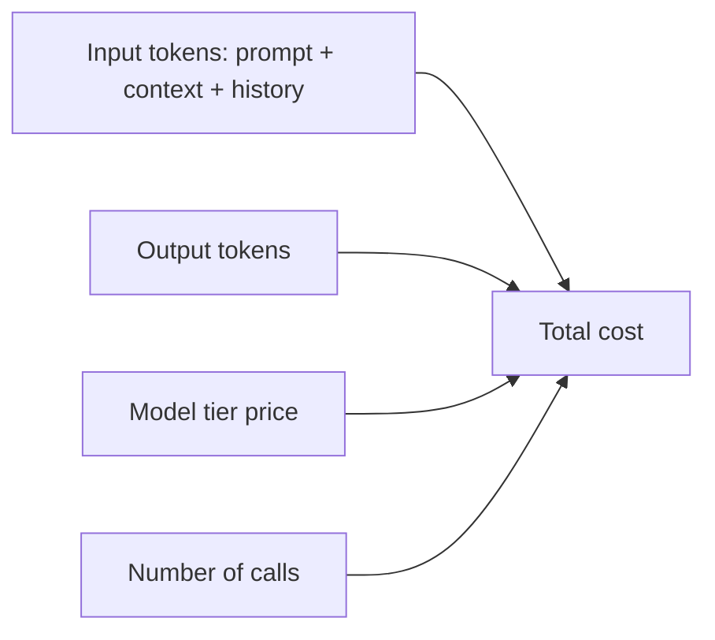

Bạn trả theo **token** — đầu vào và đầu ra, tính giá riêng. Chi phí dễ hình dung khi thấy điều gì
nuôi nó.

## Điều gì đẩy chi phí



- **Input tokens** — system prompt, [context]()
  truy xuất, và toàn bộ lịch sử hội thoại bạn gửi lại mỗi lượt.
- **Output tokens** — thường đắt hơn input.
- **Model tier** — model flagship có thể đắt gấp 10×+ model nhỏ (xem
  [Choosing a model]()).
- **Số lần gọi** — [agent]() nhân số lần gọi lên; một
  vòng lặp có thể là nhiều request cho mỗi tác vụ.

## Ví dụ — một phép tính chi phí

```text
Support bot, mỗi câu trả lời:
  input  = 2,000 tokens (system + context + câu hỏi)
  output =   300 tokens
Giá minh hoạ: $3 / 1M input, $15 / 1M output
  input  = 2000/1e6 × $3  = $0.0060
  output =  300/1e6 × $15 = $0.0045
  → ~$0.011 mỗi câu  ≈ $11 cho 1,000 câu
```

Giá chỉ minh hoạ — hãy xem giá nhà cung cấp. Điểm mấu chốt: input token (context + lịch sử)
thường chiếm phần lớn.

## Các đòn bẩy

- **Chọn đúng cỡ model** — dùng tier nhỏ hơn ở nơi chất lượng vẫn đạt.
- **Cắt gọn context** — chỉ gửi cái liên quan; đừng đổ cả tài liệu.
- **Giới hạn `max_tokens`** — chặn độ dài đầu ra.
- **Prompt caching** — tái dùng phần prefix ổn định giữa các lần gọi để giảm chi phí input.
- **Batch** cho việc offline; **stream** cho UX (không giảm chi phí, cải thiện độ trễ cảm nhận).

## Prompt caching hoạt động ra sao (KV cache)

Để sinh văn bản, model tính các **key/value (KV) state** của attention cho mọi token trong
prompt — phần tốn kém nhất. Bình thường chúng được tính lại ở mỗi lần gọi. **Prompt caching**
lưu KV state cho một prefix ổn định (system prompt dài, định nghĩa tool, một tài liệu lớn) để
lần gọi sau bắt đầu bằng cùng prefix đó **tái dùng** thay vì tính lại — giảm chi phí input và
thời gian tới token đầu tiên.

Ví dụ: một support bot có manual chính sách 8.000 token nằm đầu mọi prompt. Cache prefix đó
một lần; mỗi câu hỏi sau chỉ trả tiền xử lý câu hỏi mới, không phải cả manual lần nữa. Chỉ chạy
được khi prefix **giống hệt và ở đầu** — đặt phần ổn định trước, phần biến đổi (câu hỏi của
user) sau cùng.

## Ước lượng và theo dõi

- Đếm token bằng tokenizer trước khi ship (đừng đoán).
- Theo dõi token thật trong [Observability]() — API
  trả về `usage` ở mỗi response.

> Quy tắc: token rẻ nhất là token bạn không gửi. Đa số vấn đề chi phí thật ra là vấn đề context.

## Nguồn

- [Anthropic — Pricing](https://platform.claude.com/docs/en/about-claude/pricing)
- [Anthropic — Token counting](https://platform.claude.com/docs/en/build-with-claude/token-counting)
- [Anthropic — Prompt caching](https://platform.claude.com/docs/en/build-with-claude/prompt-caching)
