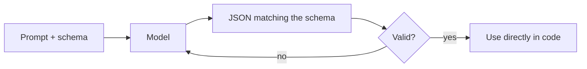

Tiếp nối [The AI API](). Để *build* với model, bạn
thường cần đầu ra code parse được — không phải văn xuôi. **Structured outputs** ràng buộc câu
trả lời của model theo một **schema** (thường là JSON).

## Ý tưởng

Bạn đưa schema; model trả về dữ liệu khớp schema; bạn validate và dùng trực tiếp.



## Ví dụ

Schema (thứ bạn yêu cầu):

```json
{ "type": "object",
  "properties": {
    "sentiment": { "type": "string", "enum": ["positive", "neutral", "negative"] },
    "score": { "type": "number" }
  },
  "required": ["sentiment", "score"] }
```

Đầu ra (thứ bạn dựa vào được):

```json
{ "sentiment": "positive", "score": 0.82 }
```

Không parse chuỗi, không "thỉnh thoảng nó thêm một câu trước JSON".

## Cách thực hiện

- **JSON / schema mode** — API ràng buộc decoding thành JSON hợp lệ theo schema của bạn.
- **Tool arguments** — tham số của một [tool call]()
  cũng là structured output; cùng cơ chế.
- **Validate + retry** — luôn validate; nếu lệch, hỏi lại.

## Vì sao quan trọng

Structured outputs là thứ biến một LLM thành **một thành phần đáng tin** trong pipeline — phân
loại, trích xuất, định tuyến, hay bất kỳ bước nào mà kết quả đưa vào code khác.

## Điểm mạnh & hạn chế

- **Điểm mạnh** — đầu ra máy đọc được, đáng tin; không phải parse chuỗi mong manh; schema được ép.
- **Hạn chế** — tính năng schema có giới hạn (không phải ràng buộc tuỳ ý); schema hoàn toàn mới có
  thể thêm độ trễ lần đầu; một refusal hoặc bị cắt vì `max_tokens` vẫn có thể làm hỏng JSON.

## Nguồn

- [OpenAI — Structured outputs](https://platform.openai.com/docs/guides/structured-outputs)
- [Anthropic — Tool use overview](https://platform.claude.com/docs/en/agents-and-tools/tool-use/overview)
