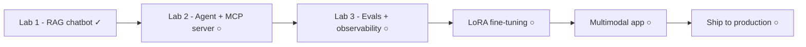

Nếu [Nền tảng]() giải thích các mảnh ghép và
[Building]() trình bày kiến trúc, thì **Giai đoạn 3** là lúc bạn gõ
phím. Mọi lab đều tăng dần: mỗi bước chạy và được kiểm chứng trước khi sang bước sau, vì hệ
thống production thực tế lớn lên đúng như vậy.

## Lộ trình

## Các lab

1. [Lab 1 — RAG chatbot trên tài liệu của chính bạn]() ✓
   — hạ tầng → ingestion → keyword search → hybrid → RAG hoàn chỉnh → monitoring + cache → agentic.
2. ○ **Lab 2 — agent với tools + tự viết một MCP server.**
3. ○ **Lab 3 — eval harness + observability** cho lab 1–2.
4. ○ **Fine-tuning thực hành (LoRA)** — tinh chỉnh một model nhỏ cho giọng và schema.
5. ○ **App multimodal** — đầu vào vision, trích xuất tài liệu.
6. ○ **Ship to production** — deploy, kiểm soát chi phí, monitoring.

## Yêu cầu trước

Hãy đi hết [mạch RAG]() của Giai đoạn 0–2 trước —
các lab mặc định bạn đã nắm khái niệm và chỉ tham chiếu thay vì giải thích lại.
