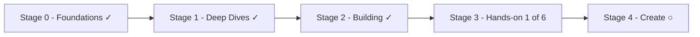

Vault này là một **bản đồ sống**, không phải cuốn sách đã đóng bìa. Mục tiêu là đi xa hơn
việc *dùng* ChatGPT hay Claude: **hiểu** các hệ thống này hoạt động ra sao, **thuần thục**
những kỹ thuật quan trọng, **xây** hệ thống thật, và cuối cùng **ship** các dự án hands-on.
Trang đã viết đánh dấu ✓; trang dự định ○ — học tới đâu điền vào tới đó.

## Hành trình

Đọc **theo hàng ngang** để tiến từng giai đoạn, hoặc chọn một hàng trong
[bảng chủ đề](#đào-sâu-một-chủ-đề) bên dưới để đào sâu một mạch kiến thức.

## Giai đoạn 0 — Nền tảng ✓

28 khái niệm trong [năm module có thứ tự](), từ *mô hình là gì*
đến *vận hành chúng trên production*:

1. **Understand** — bức tranh AI, generative AI, foundation model, LLM hoạt động ra sao,
   huấn luyện, multimodality, giới hạn.
2. **Work with a model** — API, tham số, prompting, context, structured outputs, reasoning
   model, chi phí, chọn model.
3. **Ground it in your data** — embeddings, RAG.
4. **Make it act** — tools, agents, agentic AI, MCP, AI coding assistants.
5. **Operate & govern** — guardrails, security, đánh giá, observability, responsible AI.

## Giai đoạn 1 — Deep Dives ✓

[Tám bài đào sâu]() theo cùng trục xương sống:
[prompt patterns]() ·
[vector databases]() ·
[types of RAG]() ·
[advanced RAG]() ·
[agent patterns]() ·
[agent memory]() ·
[adaptation]() ·
[evaluation in practice]().

## Giai đoạn 2 — Building with AI ✓

[Chín trang]() lắp ráp các mảnh ghép:
[AI system design]() ·
[scaling to production]() ·
[building RAG]() ·
[agentic RAG]() ·
[the agent harness]() ·
[loop engineering]() ·
[from prompts to graphs]() ·
[AI code structure]() ·
[tooling & frameworks]().

## Giai đoạn 3 — Hands-on (đang tiến hành)

[Dự án thật](), xây tăng dần:

1. ✓ **[Lab: RAG chatbot trên tài liệu của chính mình]()**
   — theo bảy bước: hạ tầng → ingestion → keyword search → hybrid search → RAG hoàn chỉnh →
   monitoring + caching → nâng cấp agentic.
2. ○ **Lab: agent với tools + tự viết một MCP server.**
3. ○ **Lab: eval harness + observability** cho lab 1–2.
4. ○ **Fine-tuning thực hành (LoRA)** — tinh chỉnh một model nhỏ cho giọng và schema.
5. ○ **App multimodal** — đầu vào vision, trích xuất tài liệu.
6. ○ **Ship to production** — deploy, kiểm soát chi phí, monitoring.

## Giai đoạn 4 — Create ○ (dự định, xa hơn)

- ○ AI product design — từ năng lực đến sản phẩm.
- ○ Case study các sản phẩm AI thật.
- ○ Ghi chú chứng chỉ & bảng ôn tập.

## Đào sâu một chủ đề

Mỗi hàng là một mạch kiến thức xuyên các giai đoạn — cách đọc vault theo chiều dọc:

| Chủ đề | Giai đoạn 0 | Giai đoạn 1 | Giai đoạn 2 | Giai đoạn 3 ○ |
| ------ | ------ | ------ | ------ | ------ |
| **Prompts** | [Prompt engineering]() · [Context engineering]() | [Prompt patterns]() | — | — |
| **Data & RAG** | [Embeddings]() · [RAG]() | [Vector databases]() · [Types of RAG]() · [Advanced RAG]() | [Building RAG]() · [Agentic RAG]() | [Lab RAG chatbot ✓]() |
| **Agents** | [Tool calling]() · [Agents]() · [Agentic AI]() · [MCP]() | [Agent patterns]() · [Agent memory]() | [Agent harness]() · [Loop engineering]() · [AI code structure]() | ○ Lab agent + MCP |
| **Operate** | [Guardrails]() · [AI security]() · [Đánh giá]() · [Observability]() · [Responsible AI]() | [Adaptation]() · [Evaluation in practice]() | [AI system design]() · [Scaling to production]() · [Tooling & frameworks]() | ○ Lab evals + ship |
