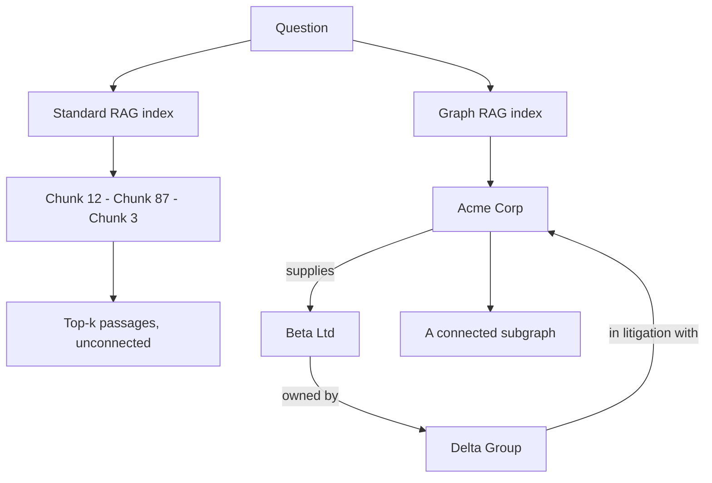
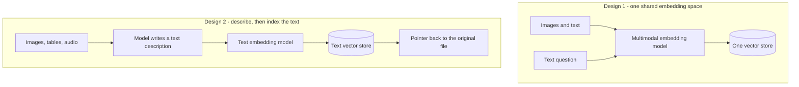
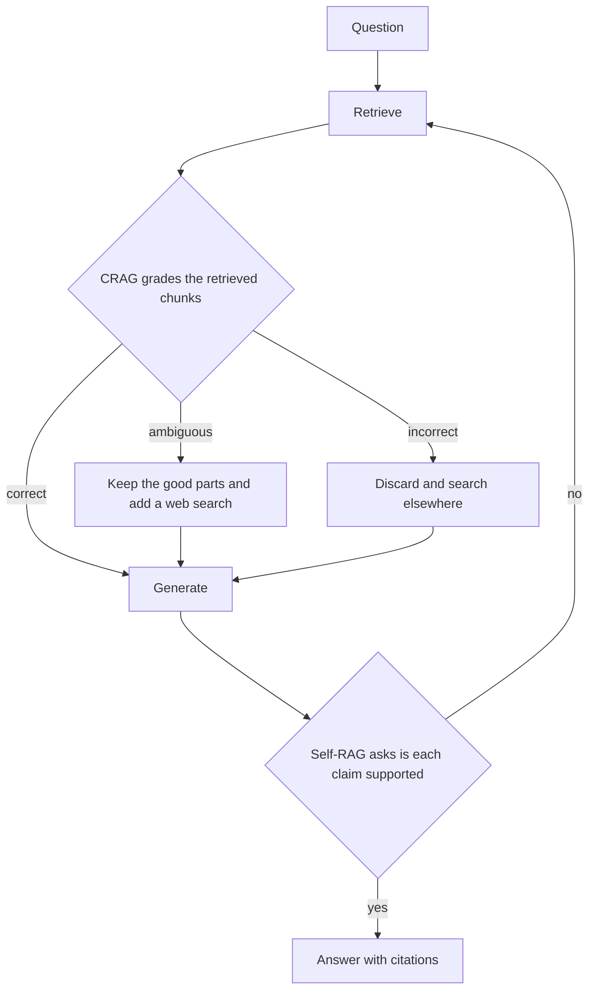
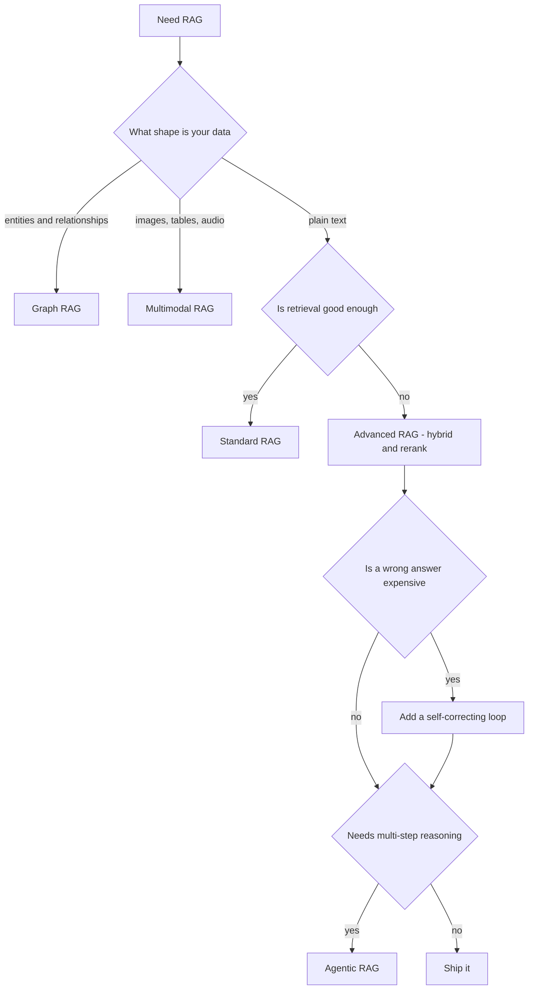

# Types of RAG Section Implementation Plan

> **For agentic workers:** REQUIRED SUB-SKILL: Use superpowers:subagent-driven-development (recommended) or superpowers:executing-plans to implement this plan task-by-task. Steps use checkbox (`- [ ]`) syntax for tracking.

**Goal:** Split `deep-dives/types-of-rag` from one flat page into a section with a short map plus three focused sub-pages, in both English and Vietnamese.

**Architecture:** The flat file becomes the folder's `_index.md` through `git mv`, so the URL `/deep-dives/types-of-rag/` and all eight inbound links keep working. Three new sub-pages carry the content nothing else in the vault owns: Graph RAG, Multimodal RAG, and self-correcting RAG (CRAG and Self-RAG). The `_index.md` is rewritten last, once its nav links have real targets.

**Tech Stack:** Hugo 0.164.0 with the Docsy theme, mermaid v11 rendered client-side, markdownlint-cli2 0.23.1.

## Global Constraints

- This repo has no unit tests. The test cycle is `npm run lint:md` and `npm run build`.
- **A broken `relref` fails the Hugo build.** `refLinksErrorLevel` is not set in `hugo.yaml`, so Hugo uses its default of `ERROR`. This is the link test. Do not add a link check script.
- **The gates are `lint 0 issues` and a successful build. Page counts are a sanity signal, not a gate.** Report the number, and do not treat a mismatch as failure on its own.
- Page counts measured on 2026-08-12: **EN 104, VI 102** before any change, and **EN 106, VI 104** after Task 1. Turning a flat page into a Hugo section is *not* net-zero in Hugo's `Pages` metric, so the running expectation is EN 107 / VI 105 after Task 2, EN 108 / VI 106 after Task 3, EN 109 / VI 107 after Task 4, and unchanged after Task 5. The authoritative check is that `content/{en,vi}/deep-dives/types-of-rag/` holds exactly the intended files and that `/deep-dives/types-of-rag/` still resolves.
- Every English page has a Vietnamese mirror with the same headings and the same structure.
- Mermaid blocks are **identical in EN and VI, with English labels**. Use `flowchart` only. Do not use `<br/>`, parentheses, or colons inside `[]` labels.
- Vietnamese pages carry a `linkTitle` in the front matter so the sidebar keeps the English label. English pages do not need one, except on `_index.md` which already has it.
- Links to foundation pages use filename-based relref, for example ``. Links to other sections use path-based relref, for example ``. Verified on 2026-08-12: `rag.md` and `multimodality.md` each exist once per language, and `content/en/roadmap/_index.md:97` already resolves `rag.md` by filename from outside foundations.
- Do not invent benchmark numbers. The comparison table uses qualitative ratings only.
- Run `npm run lint:md:fix` before every commit. Markdownlint 0.23 enforces MD060 table spacing.
- Commit messages end with the two trailer lines shown in Task 1.

---

### Task 1: Move both flat pages into folders

Structural change only. The page text is unchanged except for the one stale link. Doing this alone proves the URL survives before any new content is added.

**Files:**

- Move: `content/en/deep-dives/types-of-rag.md` to `content/en/deep-dives/types-of-rag/_index.md`
- Move: `content/vi/deep-dives/types-of-rag.md` to `content/vi/deep-dives/types-of-rag/_index.md`
- Modify: both new `_index.md` files, front matter and the "Where to go next" section

**Interfaces:**

- Consumes: nothing.
- Produces: the folder `content/{en,vi}/deep-dives/types-of-rag/`, which Tasks 2 to 4 add files to. The `_index.md` in it is a placeholder shape that Task 5 rewrites.

- [ ] **Step 1: Record the baseline build counts**

Run: `npm run build 2>&1 | tail -12`

Expected: a table reporting `Pages` as `EN 104` and `VI 102`. Write these down. If they differ, stop and report, because the plan's later checks depend on this baseline.

- [ ] **Step 2: Move both files with git mv**

```bash
mkdir -p content/en/deep-dives/types-of-rag content/vi/deep-dives/types-of-rag
git mv content/en/deep-dives/types-of-rag.md content/en/deep-dives/types-of-rag/_index.md
git mv content/vi/deep-dives/types-of-rag.md content/vi/deep-dives/types-of-rag/_index.md
```

- [ ] **Step 3: Add the section front matter keys to the English index**

In `content/en/deep-dives/types-of-rag/_index.md`, replace the front matter block with this. The two new keys are `type` and `no_list`, copied from `content/en/deep-dives/agent-memory/_index.md`.

```yaml
---
title: "Types of RAG"
linkTitle: "Types of RAG"
weight: 3
type: docs
no_list: true
description: The RAG family — standard, advanced, self-correcting, graph, multimodal, agentic — and which is an architecture vs a technique.
---
```

- [ ] **Step 4: Add the same keys to the Vietnamese index**

In `content/vi/deep-dives/types-of-rag/_index.md`, replace the front matter block with this.

```yaml
---
title: "Types of RAG"
linkTitle: "Types of RAG"
weight: 3
type: docs
no_list: true
description: Họ RAG — standard, advanced, self-correcting, graph, multimodal, agentic — và cái nào là kiến trúc vs kỹ thuật.
---
```

- [ ] **Step 5: Fix the stale Agentic RAG link in English**

In `content/en/deep-dives/types-of-rag/_index.md`, find this line under `## Where to go next`:

```markdown
- Agent-driven retrieval → Agentic RAG (Stage 2, coming soon).
```

Replace it with:

```markdown
- Agent-driven retrieval → [Agentic RAG]().
```

- [ ] **Step 6: Fix the stale Agentic RAG link in Vietnamese**

In `content/vi/deep-dives/types-of-rag/_index.md`, find this line under `## Đi tiếp`:

```markdown
- Truy xuất do agent dẫn dắt → Agentic RAG (Giai đoạn 2, sắp có).
```

Replace it with:

```markdown
- Truy xuất do agent dẫn dắt → [Agentic RAG]().
```

- [ ] **Step 7: Lint and build**

Run: `npm run lint:md:fix && npm run lint:md && npm run build 2>&1 | tail -12`

Expected: markdownlint reports `0 issues`. The build succeeds. Record the page counts and report them; as of 2026-08-12 this step produced `EN 106`, `VI 104`. A flat page becoming a section is not net-zero, so do not treat a change from the pre-task 104/102 as a failure.

- [ ] **Step 8: Confirm the URL did not move**

Run: `ls public/deep-dives/types-of-rag/index.html public/vi/deep-dives/types-of-rag/index.html`

Expected: both files exist. If the Vietnamese path differs in this site's layout, check `public/` for the actual Vietnamese path before treating it as a failure.

- [ ] **Step 9: Commit**

```bash
git add -A content/en/deep-dives/types-of-rag content/vi/deep-dives/types-of-rag
git commit -F - <<'EOF'
Move Types of RAG into a section folder

Turns the flat page into deep-dives/types-of-rag/_index.md so sub-pages
can be added. The URL is unchanged, so all inbound links still resolve.

Also fixes the stale "Agentic RAG (Stage 2, coming soon)" line. The page
building/agentic-rag exists, so it is now a real link.

Co-Authored-By: Claude Opus 5 (1M context) <noreply@anthropic.com>
Claude-Session: https://claude.ai/code/session_01LrkxGTqT9iRqF7i5S6ajDR
EOF
```

---

### Task 2: Graph RAG sub-page

**Files:**

- Create: `content/en/deep-dives/types-of-rag/graph-rag.md`
- Create: `content/vi/deep-dives/types-of-rag/graph-rag.md`

**Interfaces:**

- Consumes: the folder created in Task 1.
- Produces: the relref target ``, used by the `_index.md` nav table in Task 5.

- [ ] **Step 1: Write the English page**

Create `content/en/deep-dives/types-of-rag/graph-rag.md` with exactly this content.

````markdown
---
title: "Graph RAG"
weight: 1
description: Retrieval over entities and the relationships between them, not isolated chunks.
---

*Retrieve the connections, not just the passages.*

## What it is

Standard RAG stores documents as isolated chunks. Each chunk is retrieved on its own
similarity to the question, and nothing in the index records that chunk 12 and chunk 87 are
about the same company. Graph RAG indexes **entities and the relationships between them**,
then retrieves a connected subgraph instead of a ranked list.



## How it works

Three things happen at ingest time, not at query time:

1. **Extract.** A model reads each chunk and pulls out entities and the relations between
   them.
2. **Resolve.** Duplicates are merged, so "Acme", "Acme Corp." and "ACME" become one node.
3. **Store.** The result is written as a graph of nodes and edges.

At query time the system finds entry-point nodes for the question, then walks the edges to
collect connected facts. Microsoft's GraphRAG adds one more step: it clusters the graph into
communities and pre-writes a summary of each, so a broad question can be answered from
summaries rather than from raw chunks.

The same structure is used elsewhere in this vault for a different job. See
[Multi-agent systems]() for the knowledge graph as
*shared memory between agents*. Here it is a *retrieval index*, and the build steps are the
same.

## When to use it

- **Multi-hop questions**, where the answer needs two or three linked facts.
- **"What connects X and Y"** questions, which similarity search cannot express.
- **Corpus-wide questions**, such as "what are the recurring themes across all incident
  reports", where no single chunk holds the answer.

Do not use it for direct lookups. If the question is "what is our refund window", a chunk
already contains the answer and the graph earns nothing.

## Example

Ask a supplier assistant: *"Which of our suppliers are owned by a company we are in
litigation with?"*

Standard RAG retrieves the supplier list and the litigation memo as two separate chunks. The
model has no way to join them, so it either guesses or says it cannot tell. Graph RAG walks
`supplies` to `owned by` to `in litigation with` and returns the path, so the answer names
the supplier and shows why.

## The cost

Building the graph means running a model over the whole corpus at ingest, plus an entity
resolution pass. Documents that change need re-ingesting. That is far more expensive than
embedding chunks, and it is the reason to reach for Graph RAG only when the value really is
in the relationships.

## Sources

- Edge et al., *From Local to Global: A Graph RAG Approach to Query-Focused Summarization* (2024) — [arXiv:2404.16130](https://arxiv.org/abs/2404.16130)
````

- [ ] **Step 2: Write the Vietnamese page**

Create `content/vi/deep-dives/types-of-rag/graph-rag.md` with exactly this content. The
mermaid block is identical to the English one.

````markdown
---
title: "Graph RAG"
linkTitle: "Graph RAG"
weight: 1
description: Truy xuất trên thực thể và quan hệ giữa chúng, không phải các chunk rời rạc.
---

*Truy xuất các liên kết, không chỉ các đoạn văn.*

## Là gì

Standard RAG lưu tài liệu thành các chunk rời rạc. Mỗi chunk được truy xuất dựa trên độ tương
đồng của riêng nó với câu hỏi, và index không hề ghi lại rằng chunk 12 và chunk 87 cùng nói về
một công ty. Graph RAG index **thực thể và quan hệ giữa chúng**, rồi truy xuất một subgraph
liên thông thay vì một danh sách xếp hạng.


## Hoạt động thế nào

Ba việc xảy ra lúc ingest, không phải lúc query:

1. **Extract.** Một model đọc từng chunk và rút ra các thực thể cùng quan hệ giữa chúng.
2. **Resolve.** Gộp trùng lặp, để "Acme", "Acme Corp." và "ACME" thành một node.
3. **Store.** Kết quả được ghi thành một graph gồm node và edge.

Lúc query, hệ thống tìm các node điểm vào cho câu hỏi, rồi đi theo các edge để gom các dữ kiện
liên quan. GraphRAG của Microsoft thêm một bước nữa: gom graph thành các community và viết sẵn
tóm tắt cho từng community, nhờ đó câu hỏi diện rộng được trả lời từ tóm tắt thay vì từ chunk
thô.

Cùng cấu trúc này được dùng ở nơi khác trong vault cho một việc khác. Xem
[Multi-agent systems]() cho knowledge graph với vai
trò *bộ nhớ dùng chung giữa các agent*. Ở đây nó là *index truy xuất*, và các bước dựng là như
nhau.

## Khi nào dùng

- **Câu hỏi multi-hop**, khi câu trả lời cần hai ba dữ kiện nối nhau.
- **Câu hỏi "X và Y liên quan thế nào"**, thứ mà similarity search không diễn đạt được.
- **Câu hỏi diện rộng**, ví dụ "các chủ đề lặp lại trong toàn bộ incident report", khi không
  chunk đơn lẻ nào chứa câu trả lời.

Đừng dùng cho tra cứu trực tiếp. Nếu câu hỏi là "thời hạn hoàn tiền là bao lâu", một chunk đã
chứa sẵn câu trả lời và graph không đem lại gì.

## Ví dụ

Hỏi một trợ lý nhà cung cấp: *"Nhà cung cấp nào của chúng ta thuộc sở hữu của một công ty mà
chúng ta đang kiện tụng?"*

Standard RAG truy xuất danh sách nhà cung cấp và bản ghi nhớ kiện tụng thành hai chunk riêng.
Model không có cách nào nối chúng, nên hoặc đoán, hoặc nói không xác định được. Graph RAG đi
theo `supplies` tới `owned by` tới `in litigation with` và trả về đường đi, nên câu trả lời gọi
đúng tên nhà cung cấp và cho thấy vì sao.

## Cái giá phải trả

Dựng graph nghĩa là chạy một model trên toàn bộ corpus lúc ingest, cộng thêm một lượt entity
resolution. Tài liệu thay đổi thì phải ingest lại. Việc này đắt hơn nhiều so với embedding các
chunk, và đó là lý do chỉ chọn Graph RAG khi giá trị thật sự nằm ở các quan hệ.

## Nguồn

- Edge et al., *From Local to Global: A Graph RAG Approach to Query-Focused Summarization* (2024) — [arXiv:2404.16130](https://arxiv.org/abs/2404.16130)
````

- [ ] **Step 3: Lint and build**

Run: `npm run lint:md:fix && npm run lint:md && npm run build 2>&1 | tail -12`

Expected: markdownlint reports `0 issues`. The build succeeds. Expected page counts `EN 107`, `VI 105`. Report the actual numbers; they are a sanity signal, not a gate.

- [ ] **Step 4: Commit**

```bash
git add content/en/deep-dives/types-of-rag/graph-rag.md content/vi/deep-dives/types-of-rag/graph-rag.md
git commit -F - <<'EOF'
Add Graph RAG sub-page (EN + VI)

Chunk retrieval versus entity and relationship retrieval, the three
ingest steps, a multi-hop example, and the ingest cost. Links to
multi-agent for the knowledge graph as shared memory instead of
repeating how a graph is built.

Co-Authored-By: Claude Opus 5 (1M context) <noreply@anthropic.com>
Claude-Session: https://claude.ai/code/session_01LrkxGTqT9iRqF7i5S6ajDR
EOF
```

---

### Task 3: Multimodal RAG sub-page

**Files:**

- Create: `content/en/deep-dives/types-of-rag/multimodal-rag.md`
- Create: `content/vi/deep-dives/types-of-rag/multimodal-rag.md`

**Interfaces:**

- Consumes: the folder created in Task 1.
- Produces: the relref target ``, used by the `_index.md` nav table in Task 5.

- [ ] **Step 1: Write the English page**

Create `content/en/deep-dives/types-of-rag/multimodal-rag.md` with exactly this content.

````markdown
---
title: "Multimodal RAG"
weight: 2
description: Retrieving images, tables, and audio, not only text.
---

*When the answer is in a diagram, not a paragraph.*

## What it is

Retrieval where the source material is not prose: wiring diagrams, scanned invoices, chart
images, slide decks, call recordings. A text-only index can find the page that *mentions* the
thing, but not the thing itself.

This is about **retrieval**. For the model's ability to read images and audio as input, see
[Multimodality]().

## Two designs



## How it works

**Design 1** embeds pictures and words into the same vector space, so a text question
retrieves an image directly. This is the CLIP idea. It is elegant, and it needs a multimodal
embedding model that handles your domain well.

**Design 2** runs a vision model over each image or table at ingest, writes a text
description, and indexes that description. Keep a pointer to the original file so the answer
can show it.

Design 2 is usually the better starting point. The retrieval stack stays the text stack you
already run, the descriptions are searchable and auditable, and a wrong description is
something a human can read and fix. Parsing and OCR at ingest belong to the pipeline in
[Building a RAG system]().

## When to use it

When the meaning lives in the media. If your images are decorative and every fact is also in
the prose, index the prose and stop.

## Example

An equipment support assistant. The fix for error code `E-14` is printed in a wiring diagram,
and the manual text only says "see figure 4".

A text-only index retrieves the sentence with `E-14` in it, and the assistant answers "see
figure 4", which helps nobody. With design 2 the diagram was described at ingest, so the
retrieved context includes "figure 4 shows relay K3 between the controller and the pump". The
answer now names the part, and attaches the original image.

## The cost

Describing media is one model call per item at ingest, and descriptions can be wrong in ways
that are hard to notice. Spot-check the descriptions for your highest-value documents rather
than trusting the whole corpus.

## Sources

- Radford et al., *Learning Transferable Visual Models From Natural Language Supervision* (2021) — [arXiv:2103.00020](https://arxiv.org/abs/2103.00020)
````

- [ ] **Step 2: Write the Vietnamese page**

Create `content/vi/deep-dives/types-of-rag/multimodal-rag.md` with exactly this content. The
mermaid block is identical to the English one.

````markdown
---
title: "Multimodal RAG"
linkTitle: "Multimodal RAG"
weight: 2
description: Truy xuất ảnh, bảng, và audio, không chỉ text.
---

*Khi câu trả lời nằm trong một sơ đồ, không phải một đoạn văn.*

## Là gì

Truy xuất khi nguồn không phải văn xuôi: sơ đồ đấu nối, hóa đơn scan, ảnh biểu đồ, slide, bản
ghi cuộc gọi. Index chỉ có text tìm được trang *nhắc tới* thứ đó, nhưng không tìm được chính
thứ đó.

Trang này nói về **truy xuất**. Về khả năng model đọc ảnh và audio làm đầu vào, xem
[Multimodality]().

## Hai thiết kế


## Hoạt động thế nào

**Design 1** embed ảnh và chữ vào cùng một không gian vector, nên câu hỏi bằng text truy xuất
được ảnh trực tiếp. Đây là ý tưởng của CLIP. Nó gọn, và nó cần một multimodal embedding model
xử lý tốt lĩnh vực của bạn.

**Design 2** chạy một vision model trên từng ảnh hoặc bảng lúc ingest, viết ra một mô tả bằng
text, rồi index mô tả đó. Giữ lại con trỏ tới file gốc để câu trả lời hiển thị được nó.

Design 2 thường là điểm khởi đầu tốt hơn. Stack truy xuất vẫn là stack text bạn đang chạy, mô
tả thì tìm kiếm được và kiểm toán được, và một mô tả sai là thứ con người đọc và sửa được.
Phần parse và OCR lúc ingest thuộc về pipeline trong
[Building a RAG system]().

## Khi nào dùng

Khi ý nghĩa nằm trong media. Nếu ảnh chỉ để trang trí và mọi dữ kiện đều đã có trong văn xuôi,
cứ index văn xuôi và dừng lại ở đó.

## Ví dụ

Một trợ lý hỗ trợ thiết bị. Cách xử lý mã lỗi `E-14` được in trong một sơ đồ đấu nối, còn phần
text của sổ tay chỉ ghi "xem hình 4".

Index chỉ có text truy xuất được câu chứa `E-14`, và trợ lý trả lời "xem hình 4", chẳng giúp
được ai. Với design 2, sơ đồ đã được mô tả lúc ingest, nên context truy xuất được có câu "figure
4 shows relay K3 between the controller and the pump". Câu trả lời giờ gọi đúng tên linh kiện,
và đính kèm ảnh gốc.

## Cái giá phải trả

Mô tả media tốn một lần gọi model cho mỗi item lúc ingest, và mô tả có thể sai theo cách khó
nhận ra. Hãy kiểm tra tay các mô tả cho những tài liệu giá trị nhất, thay vì tin toàn bộ corpus.

## Nguồn

- Radford et al., *Learning Transferable Visual Models From Natural Language Supervision* (2021) — [arXiv:2103.00020](https://arxiv.org/abs/2103.00020)
````

- [ ] **Step 3: Lint and build**

Run: `npm run lint:md:fix && npm run lint:md && npm run build 2>&1 | tail -12`

Expected: markdownlint reports `0 issues`. The build succeeds. Expected page counts `EN 108`, `VI 106`. Report the actual numbers; they are a sanity signal, not a gate.

The relref target was verified on 2026-08-12: `content/en/foundations/understand/multimodality.md`
and `content/vi/foundations/understand/multimodality.md` exist, and the filename is unique within
each language, so `` resolves.

- [ ] **Step 4: Commit**

```bash
git add content/en/deep-dives/types-of-rag/multimodal-rag.md content/vi/deep-dives/types-of-rag/multimodal-rag.md
git commit -F - <<'EOF'
Add Multimodal RAG sub-page (EN + VI)

The two designs, shared embedding space versus describe-then-index, with
a recommendation for the second. Wiring diagram example, ingest cost, and
a pointer to multimodality for model input as opposed to retrieval.

Co-Authored-By: Claude Opus 5 (1M context) <noreply@anthropic.com>
Claude-Session: https://claude.ai/code/session_01LrkxGTqT9iRqF7i5S6ajDR
EOF
```

---

### Task 4: Self-correcting RAG sub-page

**Files:**

- Create: `content/en/deep-dives/types-of-rag/self-correcting.md`
- Create: `content/vi/deep-dives/types-of-rag/self-correcting.md`

**Interfaces:**

- Consumes: the folder created in Task 1.
- Produces: the relref target ``, used by the `_index.md` nav table in Task 5.

- [ ] **Step 1: Write the English page**

Create `content/en/deep-dives/types-of-rag/self-correcting.md` with exactly this content.

````markdown
---
title: "Self-Correcting RAG"
weight: 3
description: CRAG and Self-RAG — loops that grade the retrieval or the answer, and retry when it is not good enough.
---

*Check the retrieval before you trust it.*

## What it is

Standard RAG retrieves once and answers, whatever came back. A self-correcting design adds a
**grading step** and a way to retry. Two named designs do this, and they grade different
things:

- **CRAG** grades the retrieved chunks, **before** generating.
- **Self-RAG** grades its own draft answer, **after** generating, and can skip retrieval
  entirely when the question does not need it.



## How they differ

| | CRAG | Self-RAG |
| ------ | ------ | ------ |
| What it grades | the retrieved chunks | its own draft answer |
| When | before generating | after generating |
| Who decides | a small retrieval evaluator model | the generator itself, using reflection tokens it was trained to emit |
| Fallback when the grade is bad | refine the chunks, or search the web instead | retrieve again, or decline to answer |
| Always retrieves | yes | no, it first decides whether retrieval is needed |
| Extra cost per query | one evaluator call | one or more extra generation passes |

## When to use it

When a wrong answer costs more than a slow answer. Regulated advice, medical or legal
summaries, and anything a customer will act on without checking.

It is not free, and it is not a substitute for fixing retrieval. If the grader keeps returning
"incorrect", the problem is upstream. Fix chunking and hybrid search first, in
[Advanced RAG](), and add the loop on top of
retrieval that already works.

## Example

An internal policy assistant is asked: *"Can a contractor expense a business-class flight?"*

Retrieval returns the travel policy, which is written for employees, and nothing about
contractors. Standard RAG answers from the employee policy and is confidently wrong.

- **CRAG** grades that context as ambiguous. It keeps the general travel section, drops the
  employee-only clauses, and runs a second search scoped to contractor agreements.
- **Self-RAG** drafts the answer first, finds that the claim "contractors may book business
  class" has no supporting passage, and retrieves again before answering. If the second pass
  finds nothing, it says the policy does not cover this case.

Both reach the same place. CRAG gets there by doubting the input, Self-RAG by doubting itself.

## The cost

Every graded query costs at least one extra model call, and the loop can run more than once.
Latency roughly doubles in the bad case. A common compromise is to run the loop only on
queries a confidence score already flagged, rather than on all traffic. See the confidence
scoring and escalation stage in
[Building a RAG system]().

## Sources

- Asai et al., *Self-RAG: Learning to Retrieve, Generate, and Critique through Self-Reflection* (2023) — [arXiv:2310.11511](https://arxiv.org/abs/2310.11511)
- Yan et al., *Corrective Retrieval Augmented Generation* (2024) — [arXiv:2401.15884](https://arxiv.org/abs/2401.15884)
````

- [ ] **Step 2: Write the Vietnamese page**

Create `content/vi/deep-dives/types-of-rag/self-correcting.md` with exactly this content. The
mermaid block is identical to the English one.

````markdown
---
title: "Self-Correcting RAG"
linkTitle: "Self-Correcting RAG"
weight: 3
description: CRAG và Self-RAG — vòng lặp chấm điểm phần truy xuất hoặc câu trả lời, và thử lại khi chưa đủ tốt.
---

*Kiểm tra phần truy xuất trước khi tin nó.*

## Là gì

Standard RAG truy xuất một lần rồi trả lời, bất kể lấy được gì. Thiết kế self-correcting thêm
một **bước chấm điểm** và một cách thử lại. Có hai thiết kế có tên, và chúng chấm hai thứ khác
nhau:

- **CRAG** chấm các chunk truy xuất được, **trước khi** sinh câu trả lời.
- **Self-RAG** chấm bản nháp câu trả lời của chính nó, **sau khi** sinh, và có thể bỏ qua truy
  xuất hoàn toàn khi câu hỏi không cần.


## Khác nhau ở đâu

| | CRAG | Self-RAG |
| ------ | ------ | ------ |
| Chấm cái gì | các chunk truy xuất được | bản nháp câu trả lời của chính nó |
| Chấm khi nào | trước khi sinh | sau khi sinh |
| Ai quyết định | một model đánh giá truy xuất nhỏ | chính generator, qua các reflection token nó được huấn luyện để phát ra |
| Khi điểm kém thì làm gì | tinh chỉnh chunk, hoặc tìm trên web thay thế | truy xuất lại, hoặc từ chối trả lời |
| Luôn truy xuất | có | không, nó quyết định trước xem có cần truy xuất không |
| Chi phí thêm mỗi query | một lần gọi model đánh giá | một hoặc nhiều lượt sinh thêm |

## Khi nào dùng

Khi một câu trả lời sai đắt hơn một câu trả lời chậm. Tư vấn có quy định quản lý, tóm tắt y tế
hay pháp lý, và bất cứ thứ gì khách hàng sẽ làm theo mà không kiểm tra lại.

Nó không miễn phí, và nó không thay thế việc sửa khâu truy xuất. Nếu bộ chấm cứ trả về
"incorrect", vấn đề nằm ở phía trên. Sửa chunking và hybrid search trước, trong
[Advanced RAG](), rồi mới thêm vòng lặp lên trên một
khâu truy xuất đã chạy tốt.

## Ví dụ

Một trợ lý chính sách nội bộ được hỏi: *"Contractor có được thanh toán vé hạng thương gia
không?"*

Truy xuất trả về chính sách công tác, vốn viết cho nhân viên, và không có gì về contractor.
Standard RAG trả lời dựa trên chính sách nhân viên và sai một cách rất tự tin.

- **CRAG** chấm context đó là ambiguous. Nó giữ phần công tác chung, bỏ các điều khoản chỉ áp
  dụng cho nhân viên, và chạy lần tìm thứ hai giới hạn trong các hợp đồng contractor.
- **Self-RAG** viết nháp trước, phát hiện khẳng định "contractor được đặt hạng thương gia"
  không có đoạn nào chống lưng, và truy xuất lại trước khi trả lời. Nếu lượt thứ hai vẫn không
  thấy gì, nó nói rằng chính sách chưa bao trường hợp này.

Cả hai tới cùng một chỗ. CRAG tới bằng cách nghi ngờ đầu vào, Self-RAG bằng cách nghi ngờ chính
mình.

## Cái giá phải trả

Mỗi query được chấm tốn ít nhất một lần gọi model nữa, và vòng lặp có thể chạy hơn một lần. Độ
trễ gần như gấp đôi trong trường hợp xấu. Một cách dung hòa phổ biến là chỉ chạy vòng lặp cho
các query đã bị confidence score đánh dấu, thay vì cho toàn bộ traffic. Xem bước confidence
scoring và escalation trong
[Building a RAG system]().

## Nguồn

- Asai et al., *Self-RAG: Learning to Retrieve, Generate, and Critique through Self-Reflection* (2023) — [arXiv:2310.11511](https://arxiv.org/abs/2310.11511)
- Yan et al., *Corrective Retrieval Augmented Generation* (2024) — [arXiv:2401.15884](https://arxiv.org/abs/2401.15884)
````

- [ ] **Step 3: Lint and build**

Run: `npm run lint:md:fix && npm run lint:md && npm run build 2>&1 | tail -12`

Expected: markdownlint reports `0 issues`. The build succeeds. Expected page counts `EN 109`, `VI 107`. Report the actual numbers; they are a sanity signal, not a gate.

- [ ] **Step 4: Commit**

```bash
git add content/en/deep-dives/types-of-rag/self-correcting.md content/vi/deep-dives/types-of-rag/self-correcting.md
git commit -F - <<'EOF'
Add Self-Correcting RAG sub-page (EN + VI)

CRAG and Self-RAG on one page, since they answer the same question and
differ in what they grade: CRAG the retrieved chunks before generating,
Self-RAG its own draft after. One diagram covers both loops. States the
extra model call per query plainly.

Co-Authored-By: Claude Opus 5 (1M context) <noreply@anthropic.com>
Claude-Session: https://claude.ai/code/session_01LrkxGTqT9iRqF7i5S6ajDR
EOF
```

---

### Task 5: Rewrite both index pages as the map

Done last, because the nav table links only resolve once Tasks 2 to 4 exist. This task replaces
the body of both `_index.md` files entirely.

**Files:**

- Modify: `content/en/deep-dives/types-of-rag/_index.md` (full body replacement)
- Modify: `content/vi/deep-dives/types-of-rag/_index.md` (full body replacement)
- Modify: `content/en/deep-dives/_index.md:37-38` (one-line description)
- Modify: `content/vi/deep-dives/_index.md:38-39` (one-line description)

**Interfaces:**

- Consumes: `graph-rag.md`, `multimodal-rag.md`, and `self-correcting.md` from Tasks 2 to 4.
- Produces: the finished section. Nothing later depends on it.

- [ ] **Step 1: Replace the English index body**

Overwrite `content/en/deep-dives/types-of-rag/_index.md` with exactly this content. The front
matter is the one set in Task 1, unchanged.

````markdown
---
title: "Types of RAG"
linkTitle: "Types of RAG"
weight: 3
type: docs
no_list: true
description: The RAG family — standard, advanced, self-correcting, graph, multimodal, agentic — and which is an architecture vs a technique.
---

## Goal

Work out which "RAG" someone means, and pick the right one for your data, your accuracy bar,
and your budget. "RAG" has grown into a family, and its members are not all the same *kind* of
thing. This section separates them.

## The family

| Variant | What is different | Read more |
| ------ | ------ | ------ |
| **Standard (naive) RAG** | Fixed pipeline: retrieve top-k, augment, generate | [RAG]() |
| **Advanced RAG** | Same shape, better retrieval: hybrid search, re-ranking, query transforms | [Advanced RAG]() |
| **Self-correcting RAG** | Grades the retrieval or the answer, and retries | [This section]() |
| **Graph RAG** | Retrieves entities and relationships, not isolated chunks | [This section]() |
| **Multimodal RAG** | Retrieves images, tables, audio | [This section]() |
| **Agentic RAG** | An agent decides *when* and *what* to retrieve, and iterates | [Agentic RAG]() |

## Architecture, loop, or technique

This is the distinction that clears up the confusion. The family above holds three different
kinds of thing:

| Kind | What it changes | Members |
| ------ | ------ | ------ |
| **Architecture** | the *shape*: what you retrieve from | Standard, Graph, Multimodal, Agentic |
| **Control loop** | the *flow*: retrieve once, or grade and retry | CRAG, Self-RAG |
| **Technique** | one *step* inside any of the above | hybrid search, re-ranking, query transforms |

So "we use hybrid search" and "we use agentic RAG" are not the same kind of statement. The
first names a step, the second names a shape.

Lists of "six RAG architectures" usually mix all three kinds together, which is why no two of
them agree. Hybrid search is the clearest case: it is a retrieval step, and it belongs inside
[Advanced RAG](), not beside it.

## In this section

The three variants nothing else in the vault owns get their own page:

| Page | In one line | Reach for it when… |
| ------ | ------ | ------ |
| [Graph RAG]() | Index entities and relationships, retrieve a connected subgraph | The answer needs two or three linked facts |
| [Multimodal RAG]() | Retrieve images, tables, and audio, not only prose | The meaning lives in the media |
| [Self-correcting RAG]() | CRAG and Self-RAG grade the work and retry | A wrong answer costs more than a slow one |

## Choosing one

Ratings are relative to standard RAG on the same corpus. They are qualitative on purpose:
your numbers depend on your data.

| Variant | Accuracy gain | Added latency | Added cost | Complexity | Worth it when |
| ------ | ------ | ------ | ------ | ------ | ------ |
| **Standard** | baseline | baseline | baseline | low | Plain text, direct lookups |
| **Advanced** | medium | small, one re-rank pass | small | low to medium | Retrieval is the bottleneck, which it usually is |
| **Self-correcting** | high on accuracy-critical queries | high, an extra model call and sometimes a second retrieval | high | medium | A wrong answer is expensive |
| **Graph** | high on multi-hop and corpus-wide questions | medium at query time | high at ingest, a model pass over the whole corpus | high | The value is in the relationships |
| **Multimodal** | high when the answer is in the media | small at query time | medium at ingest, one call per media item | medium | Sources are not prose |
| **Agentic** | high on multi-step questions | highest, several loops per question | highest | high | The question genuinely needs several steps |

There is no best architecture. Read the row that matches **your failure**, not the row with
the highest accuracy.

## Which one?



## Where to go next

- Improve retrieval → [Advanced RAG]().
- Build the standard pipeline → [Building a RAG system]().
- Agent-driven retrieval → [Agentic RAG]().

Start simple. Move to advanced when retrieval is the bottleneck, add a loop when a wrong
answer is expensive, and go agentic only when the question genuinely needs multi-step
reasoning.

## Sources

- Lewis et al., *Retrieval-Augmented Generation for Knowledge-Intensive NLP Tasks* (2020) — [arXiv:2005.11401](https://arxiv.org/abs/2005.11401)
- Asai et al., *Self-RAG* (2023) — [arXiv:2310.11511](https://arxiv.org/abs/2310.11511)
- Yan et al., *Corrective RAG (CRAG)* (2024) — [arXiv:2401.15884](https://arxiv.org/abs/2401.15884)
- Edge et al., *From Local to Global: A Graph RAG Approach* (2024) — [arXiv:2404.16130](https://arxiv.org/abs/2404.16130)
````

- [ ] **Step 2: Replace the Vietnamese index body**

Overwrite `content/vi/deep-dives/types-of-rag/_index.md` with exactly this content. The mermaid
block is identical to the English one.

````markdown
---
title: "Types of RAG"
linkTitle: "Types of RAG"
weight: 3
type: docs
no_list: true
description: Họ RAG — standard, advanced, self-correcting, graph, multimodal, agentic — và cái nào là kiến trúc vs kỹ thuật.
---

## Mục tiêu

Xác định người ta đang nói tới "RAG" nào, và chọn đúng loại cho dữ liệu, mức chính xác, và ngân
sách của bạn. "RAG" đã phát triển thành một họ, và các thành viên không cùng một *loại* thứ.
Phần này tách bạch chúng.

## Cả họ RAG

| Biến thể | Khác ở đâu | Đọc thêm |
| ------ | ------ | ------ |
| **Standard (naive) RAG** | Pipeline cố định: retrieve top-k, augment, generate | [RAG]() |
| **Advanced RAG** | Cùng hình hài, truy xuất tốt hơn: hybrid search, re-ranking, query transform | [Advanced RAG]() |
| **Self-correcting RAG** | Chấm điểm phần truy xuất hoặc câu trả lời, rồi thử lại | [Trong phần này]() |
| **Graph RAG** | Truy xuất thực thể và quan hệ, không phải chunk rời rạc | [Trong phần này]() |
| **Multimodal RAG** | Truy xuất ảnh, bảng, audio | [Trong phần này]() |
| **Agentic RAG** | Một agent tự quyết *khi nào* và *truy gì*, có thể lặp | [Agentic RAG]() |

## Kiến trúc, vòng lặp, hay kỹ thuật

Đây là phân biệt gỡ được sự nhầm lẫn. Cả họ ở trên chứa ba loại thứ khác nhau:

| Loại | Thay đổi cái gì | Thành viên |
| ------ | ------ | ------ |
| **Kiến trúc** | *hình hài*: bạn truy xuất từ đâu | Standard, Graph, Multimodal, Agentic |
| **Vòng lặp điều khiển** | *dòng chảy*: truy xuất một lần, hay chấm rồi thử lại | CRAG, Self-RAG |
| **Kỹ thuật** | một *bước* bên trong bất kỳ loại nào ở trên | hybrid search, re-ranking, query transform |

Nên "bọn mình dùng hybrid search" và "bọn mình dùng agentic RAG" không cùng loại phát biểu. Cái
đầu gọi tên một bước, cái sau gọi tên một hình hài.

Các danh sách kiểu "sáu kiến trúc RAG" thường trộn cả ba loại vào nhau, nên không danh sách nào
khớp danh sách nào. Hybrid search là ví dụ rõ nhất: nó là một bước truy xuất, và nó thuộc về
bên trong [Advanced RAG](), không phải đứng cạnh.

## Trong phần này

Ba biến thể chưa trang nào trong vault sở hữu thì có trang riêng:

| Trang | Một dòng | Chọn khi… |
| ------ | ------ | ------ |
| [Graph RAG]() | Index thực thể và quan hệ, truy xuất một subgraph liên thông | Câu trả lời cần hai ba dữ kiện nối nhau |
| [Multimodal RAG]() | Truy xuất ảnh, bảng, audio, không chỉ văn xuôi | Ý nghĩa nằm trong media |
| [Self-correcting RAG]() | CRAG và Self-RAG chấm điểm rồi thử lại | Trả lời sai đắt hơn trả lời chậm |

## Chọn loại nào

Các mức là so với standard RAG trên cùng corpus. Chúng cố ý để định tính: con số của bạn phụ
thuộc vào dữ liệu của bạn.

| Biến thể | Tăng độ chính xác | Độ trễ thêm | Chi phí thêm | Độ phức tạp | Đáng dùng khi |
| ------ | ------ | ------ | ------ | ------ | ------ |
| **Standard** | mốc | mốc | mốc | thấp | Text thuần, câu hỏi tra cứu trực tiếp |
| **Advanced** | trung bình | nhỏ, một lượt re-rank | nhỏ | thấp đến trung bình | Truy xuất là nút thắt, và thường là vậy |
| **Self-correcting** | cao với query đòi chính xác | cao, thêm một lần gọi model và đôi khi một lượt truy xuất nữa | cao | trung bình | Một câu trả lời sai rất đắt |
| **Graph** | cao với câu hỏi multi-hop và diện rộng | trung bình lúc query | cao lúc ingest, một lượt model trên toàn corpus | cao | Giá trị nằm ở các quan hệ |
| **Multimodal** | cao khi câu trả lời nằm trong media | nhỏ lúc query | trung bình lúc ingest, một lần gọi cho mỗi media | trung bình | Nguồn không phải văn xuôi |
| **Agentic** | cao với câu hỏi nhiều bước | cao nhất, vài vòng lặp mỗi câu hỏi | cao nhất | cao | Câu hỏi thực sự cần nhiều bước |

Không có kiến trúc nào là tốt nhất. Hãy đọc dòng khớp với **thất bại của bạn**, không phải dòng
có độ chính xác cao nhất.

## Chọn loại nào?


## Đi tiếp

- Cải thiện truy xuất → [Advanced RAG]().
- Dựng pipeline chuẩn → [Building a RAG system]().
- Truy xuất do agent dẫn dắt → [Agentic RAG]().

Bắt đầu đơn giản. Lên advanced khi truy xuất là nút thắt, thêm vòng lặp khi trả lời sai rất
đắt, và lên agentic chỉ khi câu hỏi thực sự cần suy luận nhiều bước.

## Nguồn

- Lewis et al., *Retrieval-Augmented Generation for Knowledge-Intensive NLP Tasks* (2020) — [arXiv:2005.11401](https://arxiv.org/abs/2005.11401)
- Asai et al., *Self-RAG* (2023) — [arXiv:2310.11511](https://arxiv.org/abs/2310.11511)
- Yan et al., *Corrective RAG (CRAG)* (2024) — [arXiv:2401.15884](https://arxiv.org/abs/2401.15884)
- Edge et al., *From Local to Global: A Graph RAG Approach* (2024) — [arXiv:2404.16130](https://arxiv.org/abs/2404.16130)
````

- [ ] **Step 3: Update the deep-dives landing description in English**

In `content/en/deep-dives/_index.md`, find this list item:

```markdown
3. [Types of RAG]() — the RAG family; which is an
   architecture vs a technique.
```

Replace it with:

```markdown
3. [Types of RAG]() — the RAG family; architecture,
   control loop, or technique, and how to choose.
```

- [ ] **Step 4: Update the deep-dives landing description in Vietnamese**

In `content/vi/deep-dives/_index.md`, find the list item numbered 3 that links to
`/deep-dives/types-of-rag`. Its current text is "họ RAG; cái nào là kiến trúc" continuing onto
the next line. Replace the whole item with:

```markdown
3. [Types of RAG]() — họ RAG; kiến trúc, vòng lặp
   điều khiển, hay kỹ thuật, và cách chọn.
```

- [ ] **Step 5: Lint and build**

Run: `npm run lint:md:fix && npm run lint:md && npm run build 2>&1 | tail -12`

Expected: markdownlint reports `0 issues`. The build succeeds. Expected page counts `EN 109`, `VI 107`. Report the actual numbers; they are a sanity signal, not a gate.
A broken nav link would fail this build, so a clean build is the link test.

- [ ] **Step 6: Confirm every inbound link still resolves**

Run: `grep -rn "types-of-rag" content/en content/vi --include="*.md"`

Expected: the eight inbound links listed in the spec are unchanged, and all still point at
`/deep-dives/types-of-rag`. The build in Step 5 already proved they resolve.

- [ ] **Step 7: Check the rendered section by eye**

Run: `npm run serve`

Open `http://localhost:1313/ai-vault/deep-dives/types-of-rag/`. Confirm four things:

1. The sidebar groups the three sub-pages under Types of RAG, in the order Graph RAG,
   Multimodal RAG, Self-Correcting RAG.
2. Every mermaid block renders as a diagram, not as a code block. There are five in total:
   one on the index, one on each of the three sub-pages, and the two-subgraph one on
   Multimodal RAG.
3. The Vietnamese pages show the same diagrams with English labels.
4. No table overflows its column on a narrow window.

Stop the server when done.

- [ ] **Step 8: Commit**

```bash
git add content/en/deep-dives content/vi/deep-dives
git commit -F - <<'EOF'
Rewrite Types of RAG index as the section map

The index now carries the map only: goal, the family table with a
pointer to each owner page, the three-way split of architecture versus
control loop versus technique, a nav table, and a comparison table with
accuracy, latency, cost, and complexity.

The three-way split is the net-new idea. Shared lists of "six RAG
architectures" mix architectures, loops, and techniques together, which
is why they disagree. Hybrid RAG stays a technique.

Co-Authored-By: Claude Opus 5 (1M context) <noreply@anthropic.com>
Claude-Session: https://claude.ai/code/session_01LrkxGTqT9iRqF7i5S6ajDR
EOF
```

---

### Task 6: Open the pull request

**Files:** none.

**Interfaces:**

- Consumes: all commits from Tasks 1 to 5.
- Produces: nothing.

- [ ] **Step 1: Run the full check one last time**

Run: `npm run check`

Expected: lint reports `0 issues`, then the build succeeds. `npm run check` runs both.

- [ ] **Step 2: Push the branch**

```bash
git push -u origin docs/types-of-rag-section
```

- [ ] **Step 3: Open the pull request**

```bash
gh pr create --title "Split Types of RAG into a section (EN + VI)" --body "$(cat <<'EOF'
## What

Splits `deep-dives/types-of-rag` from one flat page into a section: a short map plus three
sub-pages, in both languages.

- `_index.md` — the map: the family table, the three-way split, a nav table, and a comparison
  table covering accuracy, latency, cost, and complexity.
- `graph-rag.md` — entity and relationship retrieval, the three ingest steps, a multi-hop
  example.
- `multimodal-rag.md` — shared embedding space versus describe-then-index.
- `self-correcting.md` — CRAG and Self-RAG, what each one grades, and what the loop costs.

## Why

A shared post listed six RAG architectures. Mapping it against the vault showed most of it was
already covered, with three thin spots: CRAG, Self-RAG, and Graph RAG each had one bullet or
one table row. Splitting rather than growing keeps each page short to read.

The organizing idea is new: the family holds three different kinds of thing, not two.
Architectures change the shape, control loops change the flow, and techniques change one step.
That is why published lists of "six RAG architectures" never agree with each other.

## Also fixed

`types-of-rag.md` said "Agentic RAG (Stage 2, coming soon)" in both languages, but
`building/agentic-rag` exists. It is now a real link.

## Not changed

Hybrid RAG stays a technique inside Advanced RAG, not an architecture. The URL
`/deep-dives/types-of-rag/` is unchanged, so all eight inbound links still resolve, and no
aliases were needed.

Design spec: `docs/superpowers/specs/2026-08-12-types-of-rag-section-design.md`

🤖 Generated with [Claude Code](https://claude.com/claude-code)

https://claude.ai/code/session_01LrkxGTqT9iRqF7i5S6ajDR
EOF
)"
```

- [ ] **Step 4: Wait for CI**

Run: `gh pr checks --watch`

Expected: both required checks pass, Lint Markdown and Build. Do not merge. Hand back to the
user for review.
